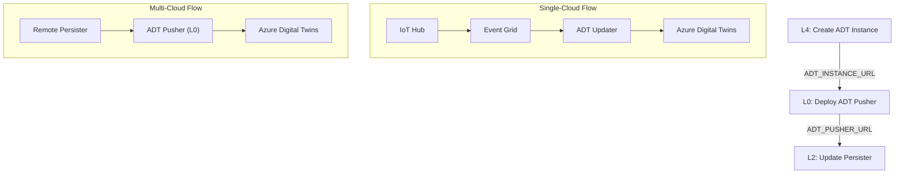

# Azure ADT Live Data Integration - Complete Implementation Plan

**Date:** 2025-12-13  
**Status:** 📋 PLANNING - AWAITING REVIEW

## Goal Description

Implement complete Azure Digital Twins (ADT) live data integration with end-to-end deployment flow. Unlike AWS TwinMaker which is **pull-based** (TwinMaker queries data from Lambdas), Azure ADT is **push-based** (data must be pushed TO ADT in real-time).

This requires changes across **three layers**:
- **L0 (Glue)**: Add ADT Pusher function for multi-cloud scenarios
- **L2 (Compute)**: Modify Persister to push to ADT (single-cloud) or ADT Pusher URL (multi-cloud)
- **L4 (Twin Management)**: Create ADT Instance, upload DTDL models, create twins

## User Review Required

> [!IMPORTANT]
> **Architectural Decision: Push vs Pull**
> 
> Azure ADT requires data to be **pushed** to it (unlike AWS TwinMaker which pulls on-demand).
>
> **Key Clarification (from investigation):**
> - **L3 Storage**: EITHER/OR pattern (local storage OR remote Hot Writer)
> - **L4 Twin Update**: IN ADDITION TO storage (data is persisted AND twin is updated)
>
> This means:
> - **Single-cloud (L1=L2=L3=L4=Azure)**: IoT Hub → Event Grid → ADT Updater handles twin updates automatically
> - **Multi-cloud (L2≠L4=Azure)**: Persister posts to ADT Pusher **in addition to** storage write

> [!NOTE]
> **ADT Push Trigger Logic**
> 
> | L2 Provider | L4 Provider | ADT Pusher Called | Reason |
> |-------------|-------------|-------------------|--------|
> | Azure | Azure | **No** | Event Grid (IoT Hub → ADT Updater) handles it |
> | AWS | Azure | **Yes** | AWS Persister must POST to Azure ADT Pusher |
> | GCP | Azure | **Yes** | GCP Persister must POST to Azure ADT Pusher |
> | Any | AWS/GCP | **No** | AWS TwinMaker is pull-based, no push needed |

> [!WARNING]
> **Deployment Order Consideration**
> 
> The flow creates a dependency chain:
> 1. L4 creates ADT Instance → produces `ADT_INSTANCE_URL`
> 2. L0 deploys ADT Pusher → needs `ADT_INSTANCE_URL`, produces `ADT_PUSHER_URL`
> 3. L2 Persister (on remote cloud) → needs `ADT_PUSHER_URL`
>
> **Solution**: ADT Pusher deployed with empty `ADT_INSTANCE_URL` initially. When L4 is deployed:
> - L4 saves `ADT_INSTANCE_URL` to `config_inter_cloud.json`
> - L0 ADT Pusher's env var is updated with the URL
> - If L4 not deployed, ADT Pusher calls will fail (acceptable - L4 deployment is mandatory)

---

## Architecture Overview

```
┌─────────────────────────────────────────────────────────────────────────────┐
│                           DATA FLOW COMPARISON                              │
├─────────────────────────────────────────────────────────────────────────────┤
│                                                                             │
│  AWS TwinMaker (PULL-BASED):                                               │
│  ┌────────────┐                    ┌─────────────────┐                     │
│  │ TwinMaker  │ ──── QUERIES ────► │ Hot Reader      │ ──► DynamoDB        │
│  └────────────┘                    │ (Data Connector)│                     │
│                                    └─────────────────┘                     │
│                                                                             │
│  Azure ADT (PUSH-BASED):                                                   │
│                                    ┌─────────────────┐     ┌─────────────┐ │
│  IoT Hub ──► EventGrid ──────────► │  ADT Updater    │ ──► │    ADT      │ │
│                                    │  (L4 Function)  │     │  Instance   │ │
│                                    └─────────────────┘     └─────────────┘ │
│                                                                             │
│  Multi-Cloud Azure ADT:                                                     │
│  Remote      ┌─────────────────┐   ┌─────────────────┐     ┌─────────────┐ │
│  Persister ─►│  ADT Pusher     │ ─►│  ADT Updater    │ ──► │    ADT      │ │
│  (AWS/GCP)   │  (L0 HTTP)      │   │  Helper Logic   │     │  Instance   │ │
│              └─────────────────┘   └─────────────────┘     └─────────────┘ │
│                                                                             │
└─────────────────────────────────────────────────────────────────────────────┘
```

---

## Proposed Changes

### Layer 0 (Glue) - Multi-Cloud ADT Receiver

When L2 is on a different cloud than L4 (Azure ADT), we need an ADT Pusher that receives HTTP POSTs from remote Persisters and updates ADT.

#### [NEW] `azure_functions/adt-pusher/function_app.py`
- HTTP-triggered Azure Function
- Validates `X-Inter-Cloud-Token` header
- Uses `_shared/adt_helper.py` to update ADT
- Environment variables: `ADT_INSTANCE_URL`, `INTER_CLOUD_TOKEN`, `DIGITAL_TWIN_INFO`

#### [MODIFY] `layers/layer_0_glue.py`
- Add `deploy_adt_pusher_function()` - deploys ADT Pusher, returns endpoint URL
- Add `destroy_adt_pusher_function()` - removes function configuration
- Add `check_adt_pusher_function()` - checks if deployed
- Configure environment: `ADT_INSTANCE_URL` (from L4), `INTER_CLOUD_TOKEN`

#### [MODIFY] `layers/l0_adapter.py`
- Add ADT Pusher deployment when `l2_provider != l4_provider` AND `l4_provider == "azure"`
- Save `l4_adt_pusher_url` and `l4_adt_pusher_token` to `config_inter_cloud.json`

---

### Layer 2 (Compute) - Persister Two-Call Pattern

The Persister needs to support **two optional remote calls**:

1. **`REMOTE_WRITER_URL`** → Cross-cloud L3 storage (**EITHER/OR** with local storage)
2. **`REMOTE_ADT_PUSHER_URL`** → Cross-cloud L4 twin updates (**IN ADDITION TO** storage)

```python
# Persister Logic Flow (pseudocode):

# Step 1: Persist to storage (L3) - EITHER/OR
if _is_multi_cloud_storage():  # L2 != L3
    post_to_remote(REMOTE_WRITER_URL, ...)  # → Remote L3 Hot Writer
else:
    local_storage.write(item)  # → Local DynamoDB/Cosmos

# Step 2: Push to ADT (L4) - IN ADDITION TO storage
if _should_push_to_adt():  # L2 != L4 AND L4 == "azure"
    post_to_remote(REMOTE_ADT_PUSHER_URL, ...)  # → Azure ADT Pusher
# Note: Single-cloud L4 (Azure-Azure) uses Event Grid, no Persister change needed
```

#### [MODIFY] `azure_functions/persister/function_app.py`
- Add new environment variables:
  - `REMOTE_ADT_PUSHER_URL` (optional) - Azure ADT Pusher endpoint
  - `ADT_PUSHER_TOKEN` (optional) - X-Inter-Cloud-Token for ADT Pusher
- Add `_should_push_to_adt()` helper function
- After storage write, call `post_to_remote()` for ADT if URL is set
- **Important**: ADT push failure should log warning but NOT fail the persist

#### [MODIFY] `aws/lambda_functions/persister/lambda_function.py`
- Same pattern as Azure Persister:
  - Add `REMOTE_ADT_PUSHER_URL` and `ADT_PUSHER_TOKEN` env vars
  - Add `_should_push_to_adt()` helper
  - Call `post_to_remote()` after storage write

#### [MODIFY] `gcp/cloud_functions/persister/main.py` (Future)
- Same pattern for GCP → Azure ADT multi-cloud

#### [MODIFY] `layers/layer_2_compute.py` (All providers)
- When deploying Persister, inject ADT Pusher env vars if:
  - `l2_provider != l4_provider` AND `l4_provider == "azure"`
- Read `REMOTE_ADT_PUSHER_URL` and `ADT_PUSHER_TOKEN` from `config_inter_cloud.json`

#### [MODIFY] `layers/l2_adapter.py` (All providers)
- Load `config_inter_cloud.json` to get ADT Pusher URL/token
- Pass to `deploy_persister_function()` for environment injection

---

### Layer 4 (Twin Management) - ADT Instance & Live Data

Create the Azure Digital Twins service and Event Grid subscription for live data updates.

#### [NEW] `layers/layer_4_adt.py`
Core ADT deployment module with:
- `create_adt_instance()` - Creates ADT instance with managed identity access
- `destroy_adt_instance()` - Deletes ADT instance
- `check_adt_instance()` - Verifies instance exists
- `upload_adt_models()` - Uploads DTDL models from `azure_hierarchy.json`
- `create_adt_twins()` - Creates twin instances with initial properties
- `destroy_adt_twins()` - Deletes twin instances
- `create_adt_relationships()` - Creates relationships between twins

#### [NEW] `layers/l4_adapter.py` (Azure)
Orchestrates L4 deployment:
- `deploy_l4()`:
  1. Create ADT Instance
  2. Upload DTDL Models
  3. Create Twins & Relationships
  4. (Single-cloud) Create Event Grid subscription → ADT Updater
  5. (Multi-cloud) Save `ADT_INSTANCE_URL` for L0 ADT Pusher
- `destroy_l4()`: Reverse order destruction
- `info_l4()`: Status checks

#### [NEW] `azure_functions/adt-updater/function_app.py`
- Event Grid triggered function
- Receives IoT Hub telemetry events
- Uses `_shared/adt_helper.py` to update ADT
- For **single-cloud only** (L1=Azure, L4=Azure)

#### [MODIFY] `_shared/adt_helper.py`
- Already exists with core logic ✅
- May need minor updates for error handling

---

### Deployment Flow Updates

#### [MODIFY] `deployer_strategy.py`
- Add `deploy_l4()` for Azure provider
- Ensure correct deployment order: Setup → L0 → L1 → L2 → L3 → L4
- For multi-cloud L4: After L4 deployment, trigger L0 ADT Pusher deployment

#### [MODIFY] `naming.py` (Azure)
- Add naming methods:
  - `adt_instance()` → `{twin}-adt`
  - `adt_pusher_function()` → `adt-pusher`
  - `adt_updater_function()` → `adt-updater`
  - `l4_function_app()` → `{twin}-l4-functions`

---

### Documentation

#### [MODIFY] `docs/docs-azure-deployment.html`
- Add L4 section describing ADT deployment
- Document Push vs Pull architecture difference
- Add DTDL model requirements

#### [MODIFY] `docs/ai-layer-implementation-guide.md`
- Add Azure L4 specific patterns
- Document ADT push-based architecture

---

### Tests

#### [NEW] `tests/unit/azure/test_layer_4_adt.py`
- ADT instance create/destroy/check tests
- Model upload tests
- Twin creation tests

#### [NEW] `tests/unit/azure/test_adt_pusher.py`
- ADT Pusher function tests
- Token validation tests
- Error handling tests

#### [MODIFY] `tests/unit/azure/test_layer_0_glue.py`
- Add tests for ADT Pusher deployment

#### [MODIFY] `tests/unit/azure/test_layer_2_compute.py`
- Add tests for Persister ADT push logic

---

## Task List

### Phase 1: L4 Core Infrastructure
- [ ] 1.1 Add Azure naming methods for ADT resources
- [ ] 1.2 Create `layer_4_adt.py` with ADT instance management
- [ ] 1.3 Create `l4_adapter.py` for Azure
- [ ] 1.4 Implement DTDL model upload from `azure_hierarchy.json`
- [ ] 1.5 Implement twin creation from hierarchy config
- [ ] 1.6 Update `deployer_strategy.py` for Azure L4

### Phase 2: L4 Live Data Functions
- [x] 2.1 Create `adt-updater/` function (Event Grid triggered)
- [x] 2.2 Create L4 Function App infrastructure
- [x] 2.3 Create Event Grid subscription (IoT Hub → ADT Updater)
- [x] 2.4 Update `adt_helper.py` if needed

### Phase 3: L0 ADT Pusher (Multi-Cloud)
- [x] 3.1 Create `adt-pusher/` function (HTTP triggered)
- [x] 3.2 Add `deploy_adt_pusher_function()` to `layer_0_glue.py`
- [x] 3.3 Update `l0_adapter.py` for multi-cloud ADT boundary
- [x] 3.4 Add to `_deploy_glue_functions()` bundle

### Phase 4: L2 Persister Updates
- [ ] 4.1 Modify Azure Persister for ADT push support
- [ ] 4.2 Modify AWS Persister for remote ADT push
- [ ] 4.3 Update L2 adapters to inject ADT Pusher URL/token
- [ ] 4.4 Update `l2_adapter.py` to read inter-cloud config

### Phase 5: Testing
- [ ] 5.1 Create L4 ADT unit tests
- [ ] 5.2 Create ADT Pusher unit tests
- [ ] 5.3 Update L0 glue tests
- [ ] 5.4 Update L2 compute tests
- [ ] 5.5 Run full test suite

### Phase 6: Documentation
- [ ] 6.1 Update Azure deployment docs
- [ ] 6.2 Update AI Layer Guide with ADT patterns

### Phase 7: Audit Layer Pre-Flight Checks (AWS & Azure)
- [ ] 7.1 Audit all AWS layer adapters' pre-flight checks (L1→L4)
- [ ] 7.2 Audit all Azure layer adapters' pre-flight checks (L1→L4)
- [ ] 7.3 Ensure each layer's `_check_*_deployed()` calls the previous layer's `info_*()` function
- [ ] 7.4 Verify ALL resources in previous layer are checked, not just a single resource
- [ ] 7.5 Update checks to return simple "everything correctly deployed: yes/no" status (no listing of missing deployments)
- [ ] 7.6 Run full test suite to verify changes

---

## Verification Plan

### Automated Tests
```bash
# Run all tests
docker exec -e PYTHONPATH=/app master-thesis-3cloud-deployer-1 python -m pytest tests/ -q

# Run specific L4 tests
docker exec -e PYTHONPATH=/app master-thesis-3cloud-deployer-1 python -m pytest tests/unit/azure/test_layer_4_adt.py -v
```

### Manual Verification
1. Deploy single-cloud Azure (L1=L2=L3=L4=Azure)
2. Send test telemetry via IoT Device Simulator
3. Verify ADT twin properties update via Azure Portal
4. Deploy multi-cloud (L1=AWS, L4=Azure)
5. Verify cross-cloud data flow works

---

## Dependencies Between Layers



---

## Summary of Files to Create/Modify

| Layer | File | Action | Purpose |
|-------|------|--------|---------|
| L0 | `azure_functions/adt-pusher/function_app.py` | NEW | HTTP receiver for multi-cloud |
| L0 | `layers/layer_0_glue.py` | MODIFY | Add ADT Pusher deploy/destroy |
| L0 | `layers/l0_adapter.py` | MODIFY | Handle L2≠L4 boundary |
| L2 | `azure_functions/persister/function_app.py` | MODIFY | Add ADT push logic |
| L2 | `aws/lambdas/persister/main.py` | MODIFY | Add remote ADT push |
| L2 | `layers/layer_2_compute.py` | MODIFY | Inject ADT Pusher env vars |
| L2 | `layers/l2_adapter.py` | MODIFY | Read inter-cloud config |
| L4 | `layers/layer_4_adt.py` | NEW | ADT instance management |
| L4 | `layers/l4_adapter.py` | NEW | L4 orchestration |
| L4 | `azure_functions/adt-updater/function_app.py` | NEW | Event Grid → ADT |
| L4 | `naming.py` | MODIFY | Add ADT naming methods |
| All | Tests | NEW | Comprehensive test coverage |
| All | Docs | MODIFY | Update deployment docs |
