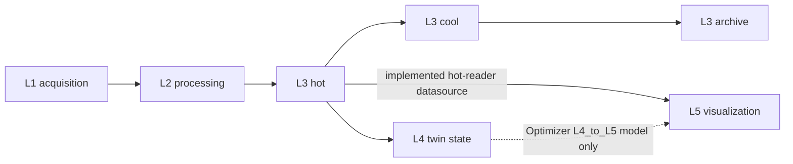
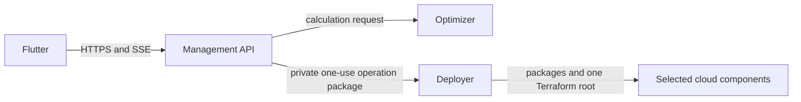

# Current Deployment Graph

This page documents the implemented Twin2MultiCloud graph reconstructed in
Phase 8.0. It is current-state evidence, not a promise about future
architecture profiles.

<!-- architecture-inventory-diagram-ids:
edge.runtime.aws.l1-to-l2
edge.runtime.aws.l2-to-l3-hot
edge.runtime.aws.l3-cool-to-l3-archive
edge.runtime.aws.l3-hot-to-l3-cool
edge.runtime.aws.l3-hot-to-l4
edge.runtime.aws.l4-to-l5
edge.runtime.aws.l3-hot-to-l5-reader
edge.runtime.azure.l1-to-l2
edge.runtime.azure.l2-to-l3-hot
edge.runtime.azure.l3-cool-to-l3-archive
edge.runtime.azure.l3-hot-to-l3-cool
edge.runtime.azure.l3-hot-to-l4
edge.runtime.azure.l4-to-l5
edge.runtime.azure.l3-hot-to-l5-reader
edge.runtime.gcp.l1-to-l2
edge.runtime.gcp.l2-to-l3-hot
edge.runtime.gcp.l3-cool-to-l3-archive
edge.runtime.gcp.l3-hot-to-l3-cool
edge.runtime.mixed.l1-to-l2
edge.runtime.mixed.l2-to-l3-hot
edge.runtime.mixed.l3-cool-to-l3-archive
edge.runtime.mixed.l3-hot-to-l3-cool
edge.runtime.mixed.l3-hot-to-l4
edge.runtime.mixed.l4-to-l5
implementation.catalog.l1-aws-iot-core
implementation.catalog.l1-azure-iot-hub
implementation.catalog.l1-gcp-pubsub
implementation.catalog.l2-aws-processing-lambdas
implementation.catalog.l2-azure-function-plan
implementation.catalog.l2-gcp-processing-functions
implementation.catalog.l3-archive-aws-s3
implementation.catalog.l3-archive-azure-blob-storage
implementation.catalog.l3-archive-gcp-cloud-storage
implementation.catalog.l3-cool-aws-s3
implementation.catalog.l3-cool-azure-blob-storage
implementation.catalog.l3-cool-gcp-cloud-storage
implementation.catalog.l3-hot-aws-dynamodb
implementation.catalog.l3-hot-azure-cosmos-db
implementation.catalog.l3-hot-gcp-firestore
implementation.catalog.l4-aws-twinmaker
implementation.catalog.l4-azure-digital-twins
implementation.catalog.l5-aws-managed-grafana
implementation.catalog.l5-azure-managed-grafana
implementation.platform.deployer
implementation.platform.flutter
implementation.platform.management-api
implementation.platform.optimizer
responsibility.cross-cloud-glue
responsibility.l1.ingestion
responsibility.l2.processing
responsibility.l3.archive-storage
responsibility.l3.cool-storage
responsibility.l3.hot-storage
responsibility.l4.twin-state
responsibility.l5.visualization
responsibility.storage-transition
trust.cross-provider
trust.flutter-to-management
trust.management-to-deployer
trust.management-to-optimizer
trust.provider-account
trust.user-code
-->

The Optimizer and resolved-deployment path contain seven deployment slots
mapped to five scientific layers. The current visualization binding diverges
from the modeled final segment:



```text
L1 -> L2 -> L3 hot -> L3 cool -> L3 archive
              +----> L4 twin -.-(modeled)-> L5 visualization
              \----> hot reader ----------> L5 visualization
```

AWS and Azure currently have deployer catalog implementations for every slot.
GCP currently stops at L3 archive; GCP L4 and L5 are explicitly unsupported.
Mixed-provider paths use destination-owned bridge/writer functions and
source-owned transition runtimes.

## Platform flow



Flutter communicates only with the Management API. The Optimizer produces the
resolved deployment specification. Management validates and persists selected
calculation evidence, projects the deployment package, resolves the selected
credential, and calls the Deployer. The Deployer validates the package, builds
static and user-function artifacts, resolves Terraform inputs, and owns
deployment execution.

Credentials are not part of function/template artifacts or public evidence.
They cross only the private, short-lived Management-to-Deployer operation
boundary and are used for provider API authorization.

## Current graph facts

- Five paper layers are not the same as the seven Optimizer slots.
- Historical `L0` is cross-provider glue, not an additional scientific layer.
- Hot-to-cool and cool-to-archive schedules are source-owned.
- Cross-provider receiver bridges/writers are destination-owned.
- Transfer routes and costs are resolved by the Optimizer pricing registry.
- `event-feedback` is user-owned code behind a platform wrapper.
- GCP digital-twin connector source files exist but are excluded from the live
  registry and do not make GCP L4 deployable.
- The Optimizer models L4-to-L5, but current AWS/Azure Grafana setup binds
  directly to a same-provider L3 hot reader. A path whose L5 provider differs
  from L3 hot lacks a current remote reader binding and is explicit unsafe debt.

The code-verified inventory contains 114 implementations, 64 package/template
artifacts, 661 Terraform objects, and 90 runtime/deployment edges. It contains
one fully evidenced predecessor finding:
`finding.l5-reader-binding-divergence`.

For the complete Function-and-Edge Matrix, provider graphs, trust boundaries,
cost ownership, stable IDs, and audit method, see
[`docs/research/phase_08_current_function_edge_matrix.md`](https://github.com/TVJunkie724/master-thesis/blob/master/docs/research/phase_08_current_function_edge_matrix.md).
