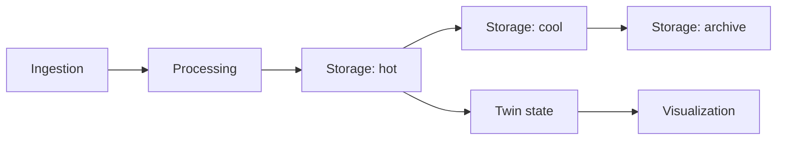

# Five-Layer Baseline Profiles

!!! warning "Historical target — not a new deployment profile"
    Phase 8.1 approved and froze this `five-layer-baseline@1` decision.
    Subsequent review keeps it immutable for read, reproduction, verification,
    and destroy; it will not become the default new-Twin runtime. See the
    [Phase 8.0 deployment-graph snapshot](current-deployment-graph.md) for the
    predecessor behavior that motivated this decision.

`five-layer-baseline@1` preserves the paper-compatible Digital Twin model:

1. ingestion receives and normalizes telemetry;
2. processing applies domain and user transformations;
3. storage owns hot, cool, and archive persistence;
4. Twin state maintains and exposes the operational or semantic Twin;
5. visualization queries Twin state for presentation.

Hot, cool, and archive storage remain three separately costed optimization
slots inside one storage responsibility. Platform orchestration and
cross-provider adapters are support components, not extra Twin layers.



## What The Decision Changes

The current AWS and Azure deployment binds Grafana directly to a provider-local
hot-storage reader even though the Optimizer models an L4-to-L5 flow. The
approved target removes that shortcut and requires a typed Twin-state query
contract and a declared component output. The Deployer resolver in Phase 8.6
must fail before Terraform when the binding is unavailable.

Provider-native triggers may remain inside an approved component or edge. They
do not create a general Eventing layer. The optional event-check and feedback
topology remains explicitly unsupported in this baseline.

## Active Five-Layer V2 Successor

`five-layer-baseline@2` remains a five-responsibility architecture but always
includes rule, action, workflow, notification, command, and outcome behavior
inside the existing owners. It removes the Eventing feature flags and adds no
sixth responsibility.

Unlike the historical `@1` target, v2 makes the predecessor's executable raw
dashboard path explicit and uses the mandatory embedded domain-event path for
Twin projection:

```text
L3 hot -> L5  raw telemetry/history
L3 hot -> L4  selected current state/model/relationships
```

Its first implementation version requires
`provider(L3_hot) == provider(L5)` and places L4 independently. This yields
three single-cloud and six `L3-hot == L5 != L4` placements. A remote
L3-hot-to-L4 projection uses the reviewed short-lived cross-cloud event bridge;
a local projection creates no bridge.

L4-to-L5 Twin-context and 3D-scene visualization are not claimed by v2. They
require a later versioned capability decision. Azure keeps Cosmos DB for L3
hot: Small and Medium use serverless, while Large must pass a calculated
autoscale RU/storage/partition proof. ADX remains an analytics-focused rejected
alternative rather than an implicit migration.

L1, L2, L3 cool, and L3 archive remain independently placeable. The reviewed
v2 target is selectable for offline calculation and architecture evaluation.
Its unresolved supervised live-capacity gates remain explicit and prevent
deployment selection.

The three storage-duration inputs are cumulative age boundaries in v2: hot
`[0,H)`, cool `[H,C)`, archive `[C,A)`, then expiry, with
`1 <= H < C < A`. Storage cost therefore uses non-overlapping residence
intervals. This correction does not rewrite historical `@1` results.

## Historical @1 Support Status

| Candidate | Frozen @1 status |
|---|---|
| All AWS | Blocked until the target L4-to-L5 binding is implemented |
| All Azure | Blocked until the target L4-to-L5 binding is implemented |
| All GCP | Unsupported for a complete path because L4/L5 are absent |
| Mixed provider | Blocked until declared cross-provider L4-to-L5 binding exists |

Pricing evidence alone never makes a candidate deployable. The platform must
first prove every mandatory component, edge, package, permission, binding, and
formula reference.

These frozen rows are evidence about `@1`, not implementation tasks that will
reactivate it. The separately versioned v2 bundles close the new deployment
paths.

## Compatibility

Existing seven provider selections and resolved-deployment specifications
remain readable while later phases migrate to profile-aware contracts. User
processors remain behind platform-owned wrappers. New extension artifacts and
bindings use the reviewed #113 contract. Phase 8.3 now maps
`processor.telemetry@1` to exact AWS, Azure, and GCP processing components,
wrappers, adapters, Terraform inputs, and permission capabilities. Runtime
execution remains historical/read-only; the generic persistence, Optimizer,
and Deployer foundations are reused by the separately versioned v2 successor.

The machine-readable target and research rationale are maintained in:

- `contracts/architecture-inventory/v1/five-layer-baseline-v1-decision.json`;
- `docs/research/five_layer_baseline_target_decision.md`.

<!-- five-layer-baseline-decision-ids:
responsibility.ingestion
responsibility.processing
responsibility.storage
responsibility.twin-state
responsibility.visualization
target.edge.runtime.aws.l1-to-l2
target.edge.runtime.aws.l2-to-l3-hot
target.edge.runtime.aws.l3-cool-to-l3-archive
target.edge.runtime.aws.l3-hot-to-l3-cool
target.edge.runtime.aws.l3-hot-to-l4
target.edge.runtime.aws.l4-to-l5
target.edge.runtime.azure.l1-to-l2
target.edge.runtime.azure.l2-to-l3-hot
target.edge.runtime.azure.l3-cool-to-l3-archive
target.edge.runtime.azure.l3-hot-to-l3-cool
target.edge.runtime.azure.l3-hot-to-l4
target.edge.runtime.azure.l4-to-l5
target.edge.runtime.gcp.l1-to-l2
target.edge.runtime.gcp.l2-to-l3-hot
target.edge.runtime.gcp.l3-cool-to-l3-archive
target.edge.runtime.gcp.l3-hot-to-l3-cool
target.edge.runtime.mixed.l1-to-l2
target.edge.runtime.mixed.l2-to-l3-hot
target.edge.runtime.mixed.l3-cool-to-l3-archive
target.edge.runtime.mixed.l3-hot-to-l3-cool
target.edge.runtime.mixed.l3-hot-to-l4
target.edge.runtime.mixed.l4-to-l5
-->
