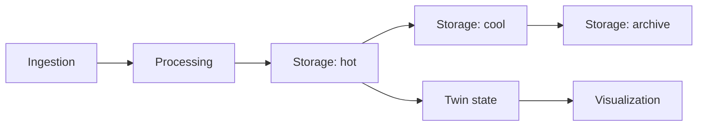

# Five-Layer Baseline Target

!!! warning "Target design — not yet current runtime behavior"
    Phase 8.1 approved this architecture decision and Phase 8.2 plus the
    user-function prerequisite provide its shared contracts. Phases 8.3-8.7
    still have to make the complete baseline the runtime path. See
    [Current Deployment Graph](current-deployment-graph.md) for behavior that
    exists today.

`five-layer-baseline@1` preserves the paper-compatible Digital Twin model:

1. ingestion receives and normalizes telemetry;
2. processing applies domain and user transformations;
3. storage owns hot, cool, and archive persistence;
4. Twin state maintains and exposes the operational or semantic Twin;
5. visualization queries Twin state for presentation.

Hot, cool, and archive storage remain three separately costed optimization
slots inside one storage responsibility. Platform orchestration and
cross-provider adapters are support components, not extra Twin layers.

## What The Decision Changes

The current AWS and Azure deployment binds Grafana directly to a provider-local
hot-storage reader even though the Optimizer models an L4-to-L5 flow. The
approved target removes that shortcut and requires a typed Twin-state query
contract and a declared component output. The Deployer resolver in Phase 8.6
must fail before Terraform when the binding is unavailable.

Provider-native triggers may remain inside an approved component or edge. They
do not create a general Eventing layer. The optional event-check and feedback
topology remains explicitly unsupported in this baseline.

## Support Status

| Candidate | Current status |
|---|---|
| All AWS | Blocked until the target L4-to-L5 binding is implemented |
| All Azure | Blocked until the target L4-to-L5 binding is implemented |
| All GCP | Unsupported for a complete path because L4/L5 are absent |
| Mixed provider | Blocked until declared cross-provider L4-to-L5 binding exists |

Pricing evidence alone never makes a candidate deployable. The platform must
first prove every mandatory component, edge, package, permission, binding, and
formula reference.

## Compatibility

Existing seven provider selections and resolved-deployment specifications
remain readable while later phases migrate to profile-aware contracts. User
processors remain behind platform-owned wrappers. New extension artifacts and
bindings now use the reviewed #113 contract, but remain non-executable until
Phase 8.3 maps their slot to an exact provider component.

The machine-readable target and research rationale are maintained in:

- `contracts/architecture-inventory/v1/five-layer-baseline-v1-decision.json`;
- `docs/research/five_layer_baseline_target_decision.md`.

<!-- five-layer-baseline-decision-ids:
responsibility.ingestion
responsibility.processing
responsibility.storage
responsibility.twin-state
responsibility.visualization
target.edge.runtime.aws.l1-to-l2
target.edge.runtime.aws.l2-to-l3-hot
target.edge.runtime.aws.l3-cool-to-l3-archive
target.edge.runtime.aws.l3-hot-to-l3-cool
target.edge.runtime.aws.l3-hot-to-l4
target.edge.runtime.aws.l4-to-l5
target.edge.runtime.azure.l1-to-l2
target.edge.runtime.azure.l2-to-l3-hot
target.edge.runtime.azure.l3-cool-to-l3-archive
target.edge.runtime.azure.l3-hot-to-l3-cool
target.edge.runtime.azure.l3-hot-to-l4
target.edge.runtime.azure.l4-to-l5
target.edge.runtime.gcp.l1-to-l2
target.edge.runtime.gcp.l2-to-l3-hot
target.edge.runtime.gcp.l3-cool-to-l3-archive
target.edge.runtime.gcp.l3-hot-to-l3-cool
target.edge.runtime.mixed.l1-to-l2
target.edge.runtime.mixed.l2-to-l3-hot
target.edge.runtime.mixed.l3-cool-to-l3-archive
target.edge.runtime.mixed.l3-hot-to-l3-cool
target.edge.runtime.mixed.l3-hot-to-l4
target.edge.runtime.mixed.l4-to-l5
-->
