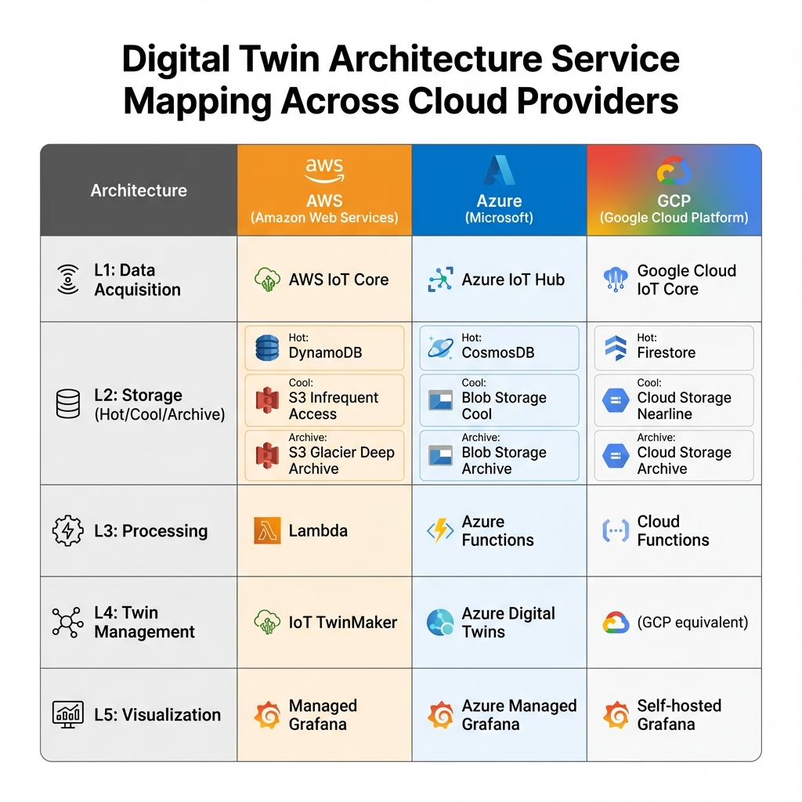
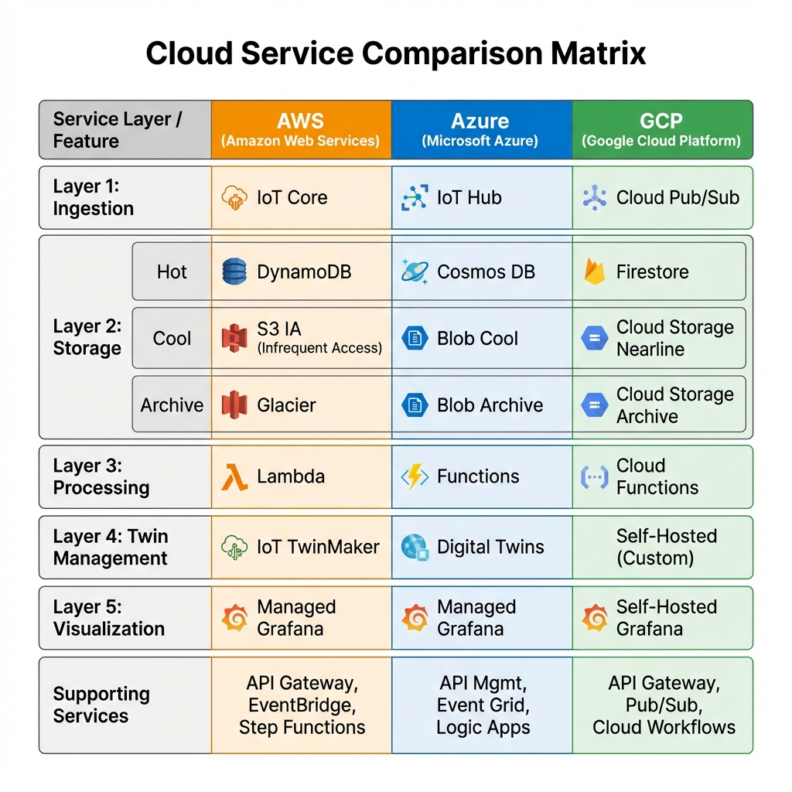
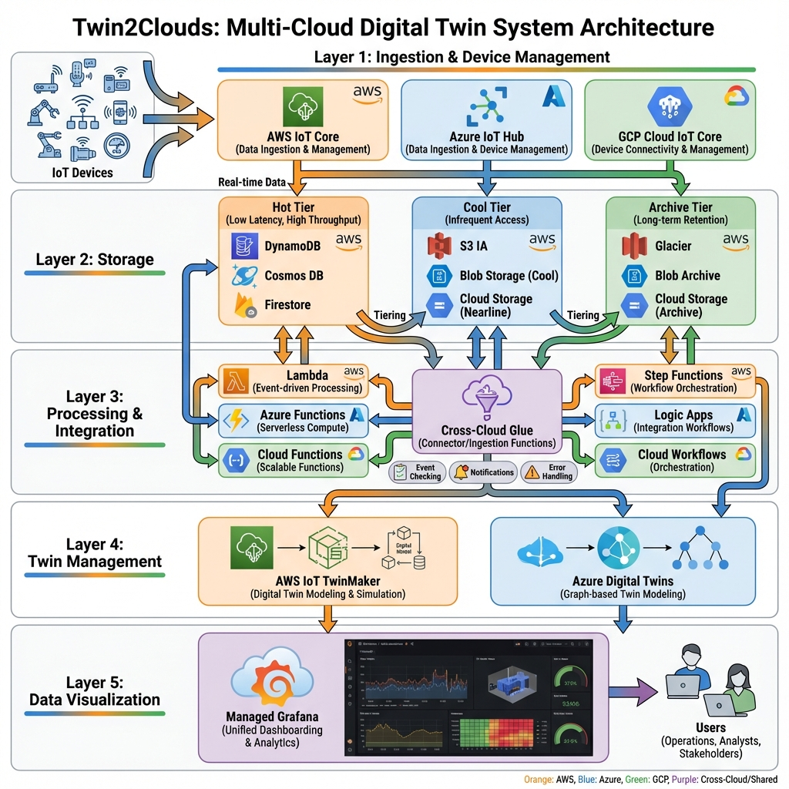
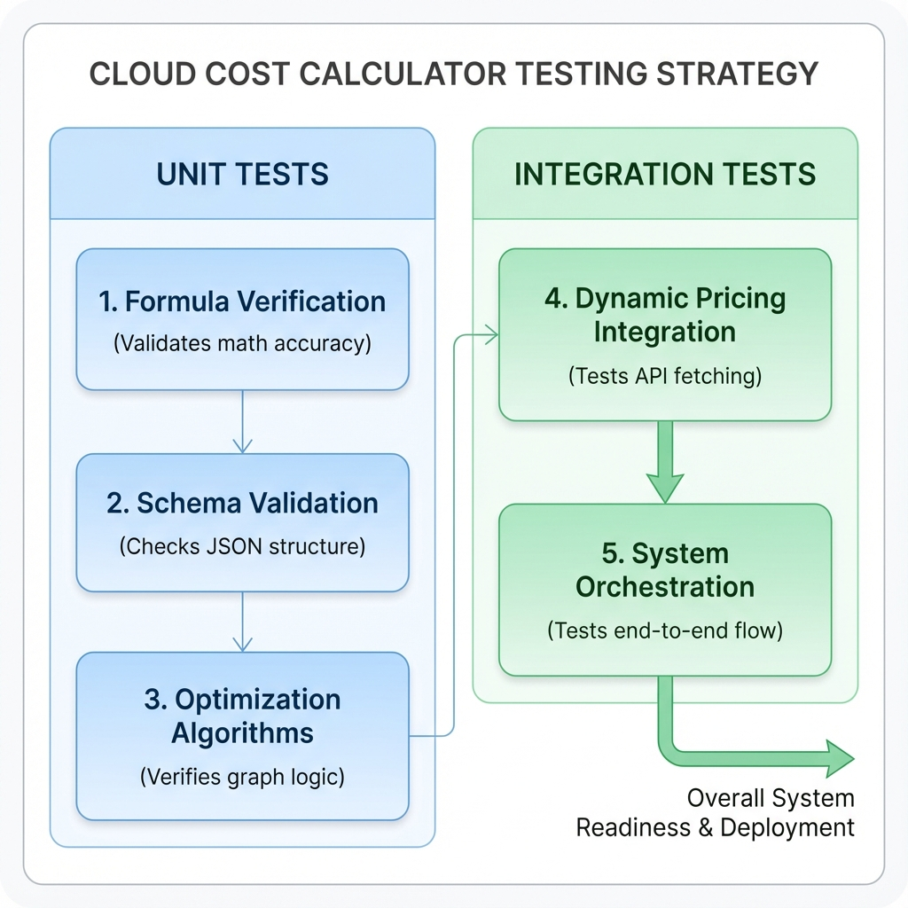

# Migrated Diagrams

These diagrams were part of the original service-local HTML documentation and are preserved here so the visual explanation remains available during the Markdown migration.

## Twin2Clouds Architecture

## Provider Layer Mapping

## Provider Service Mapping

## Project Structure

## Additional Original Diagram Assets

The original diagram files are copied from `2-twin2clouds/docs/references/`. They should be reused or redrawn only when the new documentation page requires a clearer thesis-level diagram.
