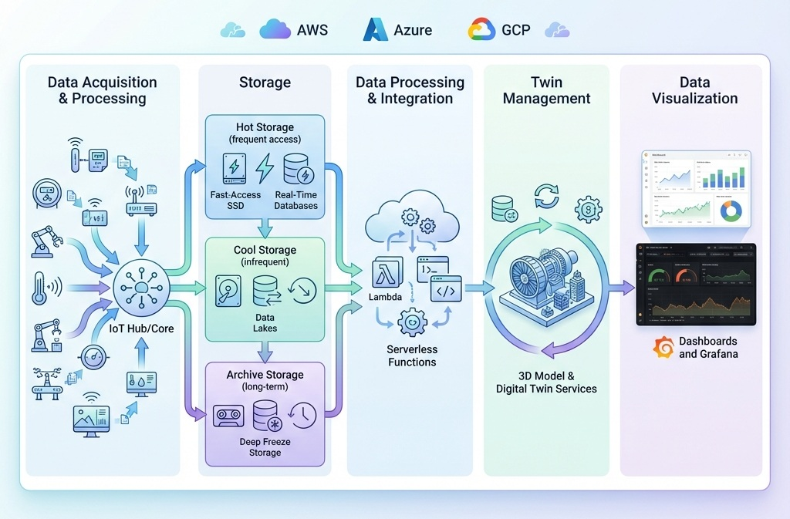

# Platform Overview

Twin2MultiCloud bridges theoretical cost optimization and practical multi-cloud Digital Twin deployment.

The platform is based on the paper [Twin2Clouds: Cost-Aware Digital Twin Engineering and Deployment Across Federated Clouds](../references/EDT_25__CloudDT_engineering.pdf) and its five-layer architecture. External records are linked from [References](../references/index.md).



1. **Data Acquisition**: ingest telemetry from devices.
2. **Processing**: transform and route telemetry.
3. **Storage**: persist hot and cold data.
4. **Management**: expose Digital Twin state and operations.
5. **Visualization**: dashboards and user-facing insight.

## Component Responsibilities

| Component | Role | Responsibility |
|-----------|------|----------------|
| Flutter UI | User interface | Capture user intent, display cost/deployment state, and call the Management API. |
| Management API | Orchestrator | Persist users, twins, configuration, state, and coordinate Optimizer/Deployer calls. |
| Twin2Clouds Optimizer | Brain | Calculate cost-optimal provider placement from scenario inputs and pricing data. |
| Cloud Deployer | Muscle | Provision provider infrastructure and execute deployment/destroy workflows. |
| Docs Site | Documentation source | Publish canonical architecture, setup, user, API, and reference documentation. |

Flutter must not call the Optimizer or Deployer directly. The stable boundary is:

```text
Flutter -> Management API -> Optimizer
Flutter -> Management API -> Deployer
```

## Workflow

1. A user defines a Digital Twin scenario in Flutter.
2. The Management API stores user intent and calls the Optimizer.
3. The Optimizer returns a recommended provider distribution.
4. The user reviews and confirms the configuration.
5. The Management API creates a deployment manifest.
6. The Deployer materializes an isolated workspace and provisions cloud resources.
7. Runtime status, logs, outputs, and verification flow back through the Management API.

## Integration Direction

The active roadmap is not to add more direct integrations, but to remove accidental coupling:

- routes become thin HTTP adapters,
- credentials move into user-scoped Cloud Connections,
- deployment workspaces become generated and ephemeral,
- published documentation moves into `docs-site/`,
- active implementation work is tracked in GitHub Issues and Milestones.

See [Architecture Roadmap](roadmap.md) for the active phase structure.
