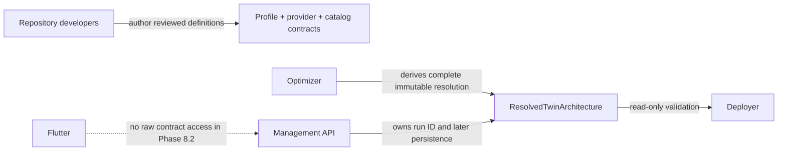

# Architecture Profile Contracts

Phase 8.2 introduces a versioned, closed-world contract boundary for describing
reviewed Twin architectures. The readers are currently dark infrastructure:
they validate repository contracts but do not change profile selection,
calculation, persistence, deployment, Terraform, or Flutter behavior.

## Four Separate Records

| Record | Owns | Must not own |
|---|---|---|
| `ArchitectureProfile` | logical responsibilities, components, ports, edges, delivery/trust requirements, workload and optimization coupling | provider services, Terraform addresses, runtime names, endpoints, credentials |
| `ProviderImplementationProfile` | one provider's capability claims and logical-to-catalog mapping | user-authored topology or physical resource values |
| `DeploymentComponentCatalog` | registered packages, runtimes, ports, permissions, pricing/formula references, and declarative Terraform bindings | runtime resource names or secret values |
| `ResolvedTwinArchitecture` | immutable selected assignments, edges, completeness, evidence, cost summary, and pinned references | source code, credentials, endpoints, ARNs, topics, or duplicated deployment dimensions |

`ResolvedTwinArchitecture` references the exact
`ResolvedDeploymentSpecification v1` digest and calculation-run ID. The
deployment specification remains the source of truth for provider-specific SKU,
capacity, memory, storage class, schedule, and billing-mode values.

## Ownership

Runtime users will select reviewed profile IDs in a later phase. They cannot
author components, edges, provider mappings, service IDs, evidence, costs,
digests, or Terraform values.

## Canonicalization And Failure Behavior

All contracts use JSON Schema Draft 2020-12, stable lowercase IDs, positive
integer versions, canonical decimal strings, sorted set-like arrays, and
`sha256:` content digests. Validation:

- resolves schemas only from the local bundle;
- rejects unknown versions, additional fields, duplicate IDs, unresolved
  references, forbidden cycles, incompatible optimization bundles, missing
  capabilities, digest tampering, and secret-like data;
- bounds document size, depth, array length, error count, paths, and messages;
- returns stable `ARCH_*` error codes consistently in all three services.

The baseline fixture keeps exactly five scientific responsibilities and seven
logical components. Provider-native triggers are edge implementation
mechanisms; they do not create a sixth scientific Eventing layer.

## Compatibility

`ResolvedDeploymentSpecification v1` remains unchanged and baseline-only. Its
fixed enums cannot represent a later Eventing profile. Eventing can become
deployable only after a separate decision gate and a new deployment
specification version with v1 read support.

See [Architecture Contract Development](../developer-guide/architecture-profile-contracts.md)
for synchronization and extension rules.
