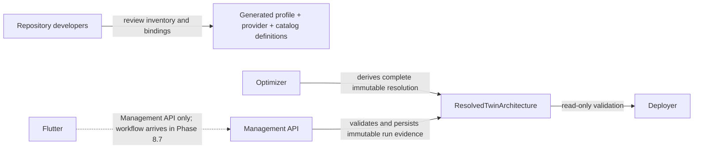

# Architecture Profile Contracts

Phases 8.2 through 8.5 provide a versioned, closed-world contract boundary,
repository-owned production definitions, profile-bounded Optimizer resolution,
and Management-owned persistence for reviewed Twin architectures. Profile
list/detail/select/preview APIs and owner-scoped resolved-architecture reads
are active. Optimizer emission and Management admission are implemented behind
a default-off gate. Deployer graph execution, runtime activation, Terraform,
and Flutter presentation remain staged for later phases.

## Four Separate Records

| Record | Owns | Must not own |
|---|---|---|
| `ArchitectureProfile` | logical responsibilities, components, ports, edges, exact optimization slots and functional-completeness rules, delivery/trust requirements, workload and optimization coupling | provider services, Terraform addresses, runtime names, endpoints, credentials |
| `ProviderImplementationProfile` | one provider's capability claims and logical-to-catalog mapping | user-authored topology or physical resource values |
| `DeploymentComponentCatalog` | registered packages, runtimes, ports, permissions, pricing/formula references, and declarative Terraform bindings | runtime resource names or secret values |
| `ResolvedTwinArchitecture` | immutable selected assignments, edges, completeness, evidence, cost summary, and pinned references | source code, credentials, endpoints, ARNs, topics, or duplicated deployment dimensions |

`ResolvedTwinArchitecture` references the exact
`ResolvedDeploymentSpecification v1` digest and calculation-run ID. The
deployment specification remains the source of truth for provider-specific SKU,
capacity, memory, storage class, schedule, and billing-mode values.

## Ownership

Authenticated Management clients can select only reviewed profile IDs and
versions using a server-derived invalidation preview, revision, and digest.
They cannot author components, edges, provider mappings, service IDs, evidence,
costs, digests, or Terraform values.

## Dark Calculation And Admission

The public Management workload schema contains neither `architectureProfile`
nor `extensionBindings`. When the Phase 8.5 gate is enabled for canonical
offline fixtures, Management reads the selected profile and current active
bindings from owner-scoped persistence, computes the canonical configuration
digests, and sends only immutable references to the Optimizer. The Optimizer
admits candidates only after component, capability, port, edge, region,
pricing/formula, deployment-mapping, and extension completeness checks.

The winning complete path produces the legacy five-layer compatibility fields,
the existing `ResolvedDeploymentSpecification v1`, and one deterministic
`ResolvedTwinArchitecture v1` from the same candidate. Management validates
their run, profile, optimization-bundle, pricing, deployment, cost, extension,
and digest cross-links before one atomic commit. A malformed response persists
only bounded failed-run metadata and never becomes a legacy success.

`ARCHITECTURE_PROFILE_RESOLUTION_ENABLED` defaults to `false` in both services.
The repository provider profiles remain unsupported until Phase 8.6. The
supported fixtures prove the resolver and persistence path without bypassing
that runtime state.

## Management Persistence

Migration `022_resolved_twin_architecture` creates one pinned profile selection
per Twin and classifies historical runs conservatively. A historical run is
reconstructed only when its embedded architecture, calculation result,
deployment specification, profile, extension bindings, costs, and digests all
match. Otherwise it becomes `legacy_not_resolvable`, receives no fabricated
resolution, and is deselected.

One immutable canonical resolution belongs to one calculation run. Queryable
component and edge rows are server-derived projections and must reproduce its
canonical JSON exactly. The seven `cheapest_l*` fields remain only a
round-trip-checked projection for `five-layer-baseline@1`.

## Canonicalization And Failure Behavior

All contracts use JSON Schema Draft 2020-12, stable lowercase IDs, positive
integer versions, canonical decimal strings, sorted set-like arrays, and
`sha256:` content digests. Validation:

- resolves schemas only from the local bundle;
- rejects unknown versions, additional fields, duplicate IDs, unresolved
  references, forbidden cycles, incompatible optimization bundles, missing
  capabilities, digest tampering, and secret-like data;
- bounds document size, depth, array length, error count, paths, and messages;
- returns stable `ARCH_*` error codes consistently in all three services.

The baseline fixture keeps exactly five scientific responsibilities, seven
logical components, seven optimization slots, and all twelve approved
functional-completeness rules. Provider-native triggers are edge
implementation mechanisms; they do not create a sixth scientific Eventing
layer.

## Registered Baseline Realization

The Phase 8.3 catalog contains 22 reviewed deployment bundles covering all 42
deployment-dimension components, 33 Phase 8.1 decision-traced edge
implementations, 43 content-addressed platform/shared artifacts, and 51
explicitly owned Terraform resources. AWS and Azure each map all seven logical
components and the five Phase 8.3-owned baseline edges. They remain fail-closed with
`PROFILE_TARGET_NOT_IMPLEMENTED` until Phase 8.6 compiles the typed L4-to-L5
binding. GCP maps the supported L1-L3 subset and remains unsupported for a
complete baseline because L4/L5 are absent.

The catalog binds `processor.telemetry@1` inside the processing responsibility
to the reviewed Python 3.11 provider adapters. Its catalog-completeness
scenario is supported now that #113 is complete, while profile selection
and read APIs are active and architecture-aware calculation admission remains
dark. This is a user-function extension point, not an Eventing responsibility
or layer.

## Compatibility

`ResolvedDeploymentSpecification v1` remains unchanged and baseline-only. Its
fixed enums cannot represent a later Eventing profile. Eventing can become
deployable only after a separate decision gate and a new deployment
specification version with v1 read support.

See [Architecture Contract Development](../developer-guide/architecture-profile-contracts.md)
for synchronization and extension rules.
