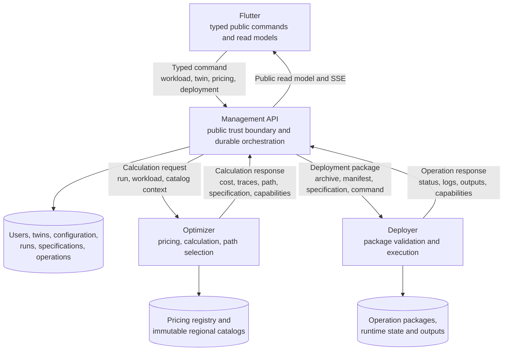
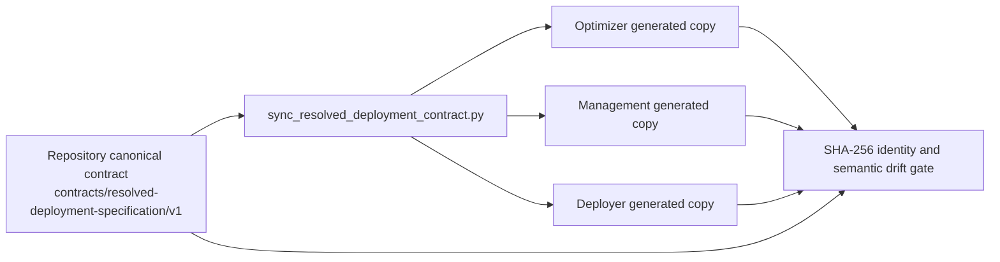

# Cross-Project Contract Map

## Contract Production And Consumption



Arrow direction expresses contract production and consumption. Optimizer artifacts
return through the Management API; Flutter never receives an internal service payload
directly. Labels ending in `response` describe grouped HTTP payload content; the
versioned contracts inside those payloads are listed below.

## Material Contract Inventory

| Contract | Producer / SSOT | Validator and durable owner | Consumer |
|---|---|---|---|
| public Management API OpenAPI/Pydantic schemas | Management API | Management API route/service boundary | Flutter |
| `provider-service-capabilities.v1` | Optimizer and Deployer independently | Management API aggregate service | Management API |
| `platform-provider-capabilities.v1` | Management API | Management API | Flutter |
| pricing registry YAML contracts | `2-twin2clouds/pricing_registry` | Optimizer startup and validation gates | pricing refresh and calculation |
| immutable provider-region catalog/reference | Optimizer catalog repository | Optimizer, then exact-reference verification by Management | calculation and diagnostics |
| `cost-result.v1` and intent traces | Optimizer | Management API | persisted run and Flutter read model |
| complete-path transfer and optimization contracts | Optimizer | Management API transfer/path validators | persisted result items and Flutter |
| `resolved-deployment-specification.v1` | repository root schema/registry; object emitted by Optimizer | Optimizer, Management API, and Deployer | manifest builder and typed tfvars translator |
| `DeploymentManifest 2.0` | Management API | Deployer | operation package and execution |
| one-use operation package | Deployer package store | Deployer | one deployment or destroy acquisition |
| deployment status, logs, outputs | Deployer execution boundary | Management API | Flutter REST/SSE read models |

## Shared Contract Propagation



Generated copies are never edited by hand. The canonical synchronization and
deployment drift gate is:

```bash
./thesis.sh test deployment-contract
```

## Versioning Rule

Durable contract versions identify wire semantics, not application release numbers.
Backward-compatible additive fields may be accepted by existing readers. Removed,
renamed, or semantically changed required fields need a coordinated new contract
version or an explicit migration path. Historical results may remain readable while
being marked non-deployable.

See [API And Contracts](../developer-guide/contracts.md) for detailed invariants.
