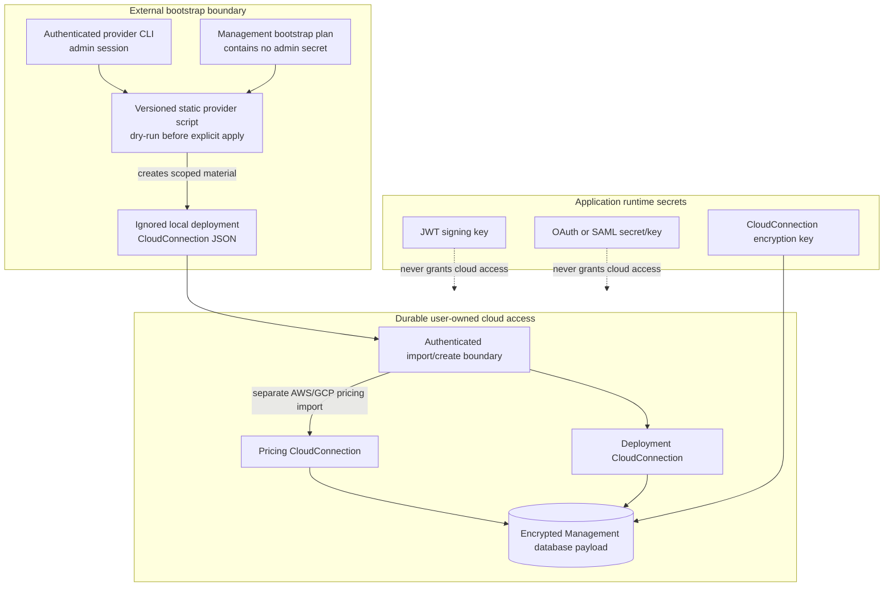
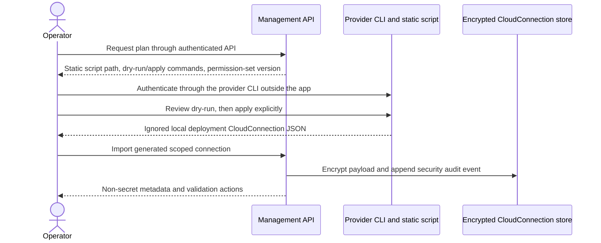
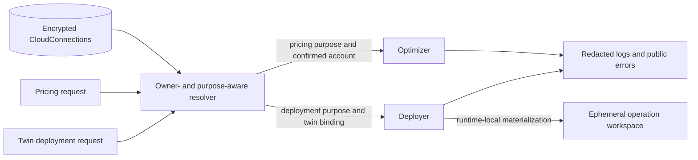

# Credentials And Trust

## Credential Categories

Application runtime secrets and cloud-provider credentials are different security
domains. Neither may substitute for the other. The current bootstrap scripts create
deployment identities only; AWS and GCP pricing connections are imported separately,
while Azure pricing uses a public API.

## Bootstrap And Reuse

The Management API never receives the bootstrap/admin credential. The reusable object
is the generated scoped deployment CloudConnection. Admin authentication remains in
the external provider CLI session, and the generated local JSON must not be committed.
The API contract is implemented, but Flutter does not currently expose the bootstrap
plan/import workflow; use authenticated OpenAPI/HTTP access for this operation.
See [Cloud Setup](../cloud-setup/index.md) for the operator sequence.

## Purpose-Aware Runtime Resolution

AWS and GCP pricing refreshes require an explicitly confirmed pricing
CloudConnection. Azure catalog pricing uses its public API path. Deployment
connections are bound to twins and are not silently reused as pricing defaults.

## Secret Exit Rules

| Boundary | Allowed to leave | Forbidden to leave |
|---|---|---|
| bootstrap plan API | provider/account metadata, permission-set version, static commands | admin credential plaintext |
| external bootstrap script | ignored local scoped deployment credential | admin secrets as script arguments or committed output |
| encrypted store | owner-safe CloudConnection metadata | decrypted payload |
| Optimizer validation | typed status, safe error code/message | echoed credential fragments |
| Deployer operation | structured redacted logs, status, allowlisted outputs | credential files, Terraform secret values |
| Flutter API | labels, purpose, provider, account/project identity, validation state | secret material |

See [Security And Trust Boundaries](../architecture/security-boundaries.md) and
[Cloud Accounts](../user-guide/cloud-accounts.md).
