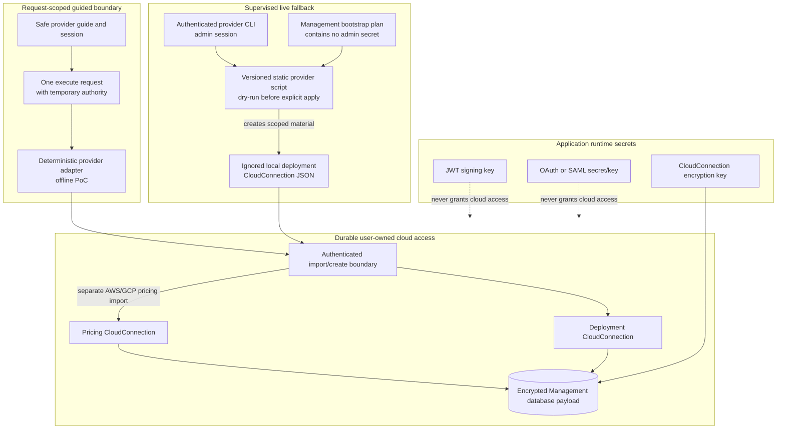
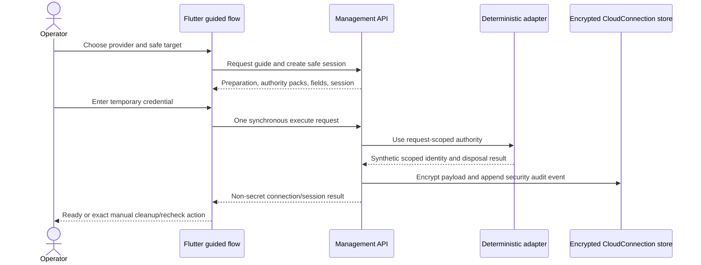
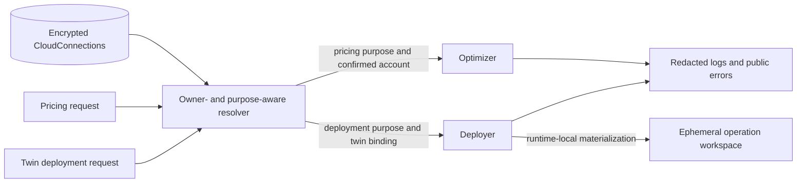

# Credentials And Trust

## Credential Categories

```mermaid
flowchart TB
    subgraph RuntimeSecrets["Application runtime secrets"]
        JWT["JWT signing key"]
        Encryption["CloudConnection encryption key"]
        IdentitySecret["OAuth or SAML secret/key"]
    end

    subgraph GuidedBootstrap["Request-scoped guided boundary"]
        Guide["Safe provider guide and session"]
        Execute["One execute request<br/>with temporary authority"]
        Adapter["Deterministic provider adapter<br/>offline PoC"]
    end

    subgraph ManualFallback["Supervised live fallback"]
        Admin["Authenticated provider CLI<br/>admin session"]
        Plan["Management bootstrap plan<br/>contains no admin secret"]
        Script["Versioned static provider script<br/>dry-run before explicit apply"]
        Generated["Ignored local deployment<br/>CloudConnection JSON"]
    end

    subgraph Durable["Durable user-owned cloud access"]
        Import["Authenticated import/create boundary"]
        Pricing["Pricing CloudConnection"]
        Deployment["Deployment CloudConnection"]
        Store[("Encrypted Management database payload")]
    end

    Guide --> Execute --> Adapter --> Import
    Admin --> Script
    Plan --> Script
    Script -->|"creates scoped material"| Generated
    Generated --> Import --> Deployment
    Import -->|"separate AWS/GCP pricing import"| Pricing
    Pricing --> Store
    Deployment --> Store
    Encryption --> Store
    JWT -. "never grants cloud access" .-> Durable
    IdentitySecret -. "never grants cloud access" .-> Durable
```

Application runtime secrets and cloud-provider credentials are different security
domains. Neither may substitute for the other. The deterministic guided adapters and
current bootstrap scripts create deployment identities only; AWS and GCP pricing
connections are imported separately, while Azure pricing uses a public API.

## Bootstrap And Reuse

```mermaid
sequenceDiagram
    actor Operator
    participant UI as Flutter guided flow
    participant API as Management API
    participant Adapter as Deterministic adapter
    participant DB as Encrypted CloudConnection store

    Operator->>UI: Choose provider and safe target
    UI->>API: Request guide and create safe session
    API-->>UI: Preparation, authority packs, fields, session
    Operator->>UI: Enter temporary credential
    UI->>API: One synchronous execute request
    API->>Adapter: Use request-scoped authority
    Adapter-->>API: Synthetic scoped identity and disposal result
    API->>DB: Encrypt payload and append security audit event
    API-->>UI: Non-secret connection/session result
    UI-->>Operator: Ready or exact manual cleanup/recheck action
```

In the guided path, the Management API receives the bootstrap credential only in
the synchronous execute request. It excludes it from session state, persistence,
diagnostics, retry payloads, and responses. The reusable object is the generated
scoped deployment CloudConnection, stored encrypted. Local integration scans
Management logs and SQLite database/WAL/SHM files for the submitted sentinel.

The offline adapter is deterministic and performs no cloud mutation. Production
fails closed. In the supervised manual fallback, administrator authentication
remains entirely in the provider CLI session and the generated local JSON must
not be committed. See [Cloud Setup](../cloud-setup/index.md) for both sequences.

## Purpose-Aware Runtime Resolution

```mermaid
flowchart LR
    Store[("Encrypted CloudConnections")]
    Resolver["Owner- and purpose-aware resolver"]
    Pricing["Pricing request"]
    Deployment["Twin deployment request"]
    Optimizer["Optimizer"]
    Deployer["Deployer"]
    Workspace["Ephemeral operation workspace"]
    Logs["Redacted logs and public errors"]

    Store --> Resolver
    Pricing --> Resolver
    Deployment --> Resolver
    Resolver -->|"pricing purpose and confirmed account"| Optimizer
    Resolver -->|"deployment purpose and twin binding"| Deployer
    Deployer -->|"runtime-local materialization"| Workspace
    Optimizer --> Logs
    Deployer --> Logs
```

AWS and GCP pricing refreshes require an explicitly confirmed pricing
CloudConnection. Azure catalog pricing uses its public API path. Deployment
connections are bound to twins and are not silently reused as pricing defaults.

## Secret Exit Rules

| Boundary | Allowed to leave | Forbidden to leave |
|---|---|---|
| bootstrap guide/session API | safe target, authority/deployment-pack metadata, findings, disposal state, generated connection summary | credential payload, secret-derived text, provider response payload |
| bootstrap execute request | temporary credential in the request body only | durable session, log, trace, metric, retry, error, or response copies |
| bootstrap plan API | provider/account metadata, permission-set version, static commands | admin credential plaintext |
| external bootstrap script | ignored local scoped deployment credential | admin secrets as script arguments or committed output |
| encrypted store | owner-safe CloudConnection metadata | decrypted payload |
| Optimizer validation | typed status, safe error code/message | echoed credential fragments |
| Deployer operation | structured redacted logs, status, allowlisted outputs | credential files, Terraform secret values |
| Flutter API responses/state | labels, purpose, provider, account/project identity, validation/session/disposal state | submitted credential material |

See [Security And Trust Boundaries](../architecture/security-boundaries.md) and
[Cloud Accounts](../user-guide/cloud-accounts.md).
