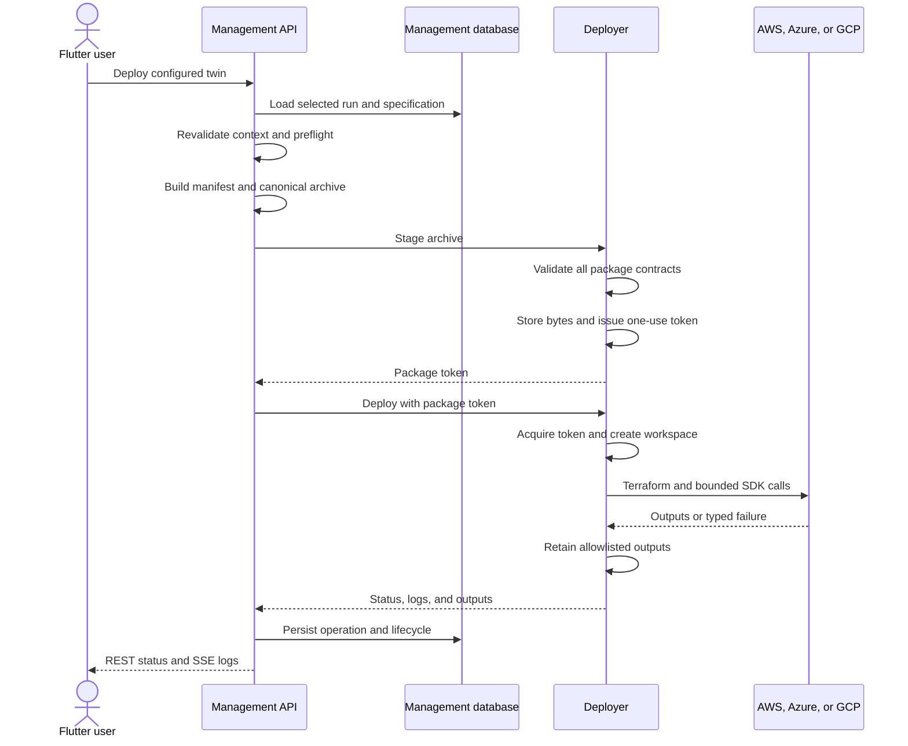
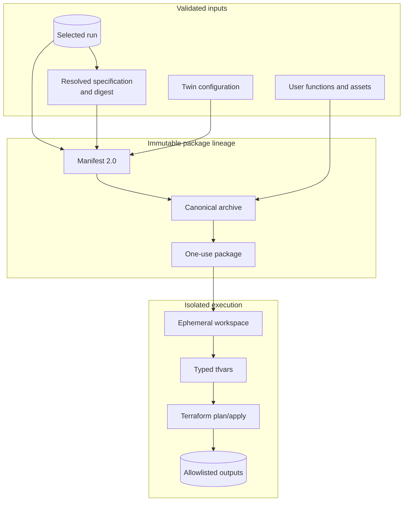
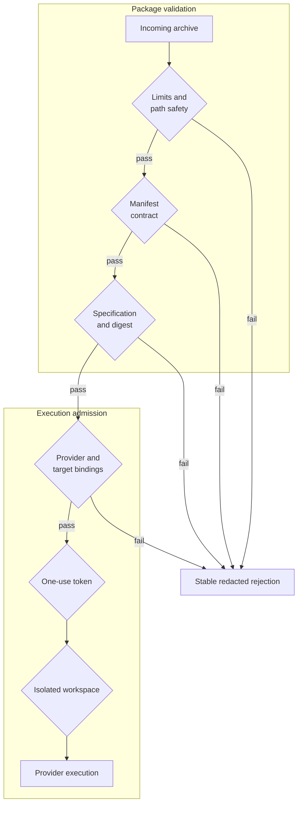

# Deployment Lifecycle

## Selected Run To Provider Resources

## Artifact Lineage

The manifest carries the exact specification object and digest; it does not ask the
Deployer to repeat optimizer decisions. Only dimensions classified as
`deployable_selection` and registered with a `terraform_target` become tfvars.
Usage tiers, account-scoped plans, and non-deployable assumptions remain evidence.

## Validation Gates

No downstream component may recreate a missing dimension from calculator defaults,
template defaults, or Terraform defaults. Missing, stale, conflicting, unknown, or
secret-like data fails before provider execution.

## Operation Observability

The Management API persists lifecycle state and normalized operation records.
Deployer logs cross the boundary as structured events and are redacted before public
exposure. Flutter observes status through REST and logs through Management-owned SSE;
it does not connect to the Deployer stream directly.

See [Deployer](../components/deployer.md) and
[Deployment And Verification](../user-guide/deployment.md).
