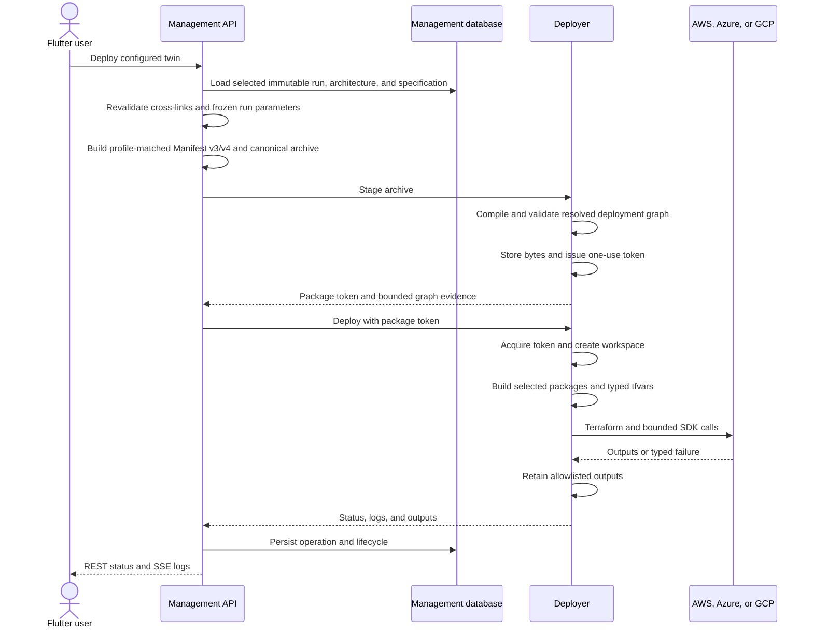
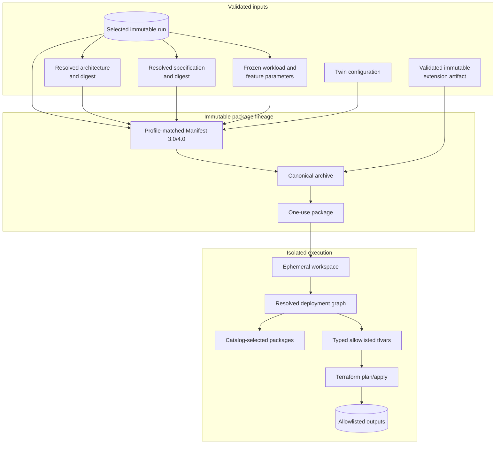
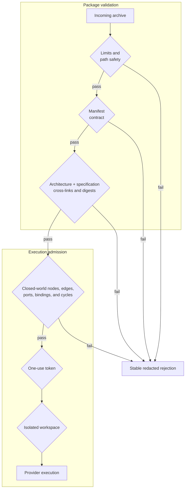

# Deployment Lifecycle

## Selected Run To Provider Resources

```mermaid
sequenceDiagram
    actor Client as Flutter user
    participant API as Management API
    participant DB as Management database
    participant Deployer
    participant Cloud as AWS, Azure, or GCP

    Client->>API: Deploy configured twin
    API->>DB: Load selected immutable run, architecture, and specification
    API->>API: Revalidate cross-links and frozen run parameters
    API->>API: Build profile-matched Manifest v3/v4 and canonical archive
    API->>Deployer: Stage archive
    Deployer->>Deployer: Compile and validate resolved deployment graph
    Deployer->>Deployer: Store bytes and issue one-use token
    Deployer-->>API: Package token and bounded graph evidence
    API->>Deployer: Deploy with package token
    Deployer->>Deployer: Acquire token and create workspace
    Deployer->>Deployer: Build selected packages and typed tfvars
    Deployer->>Cloud: Terraform and bounded SDK calls
    Cloud-->>Deployer: Outputs or typed failure
    Deployer->>Deployer: Retain allowlisted outputs
    Deployer-->>API: Status, logs, and outputs
    API->>DB: Persist operation and lifecycle
    API-->>Client: REST status and SSE logs
```

## Artifact Lineage

```mermaid
flowchart TD
    subgraph Inputs["Validated inputs"]
        direction LR
        Run[("Selected immutable run")] --> Architecture["Resolved architecture<br/>and digest"]
        Run --> Specification["Resolved specification<br/>and digest"]
        Run --> Parameters["Frozen workload and<br/>feature parameters"]
        Config["Twin configuration"]
        UserArtifacts["Validated immutable<br/>extension artifact"]
    end

    subgraph Packaging["Immutable package lineage"]
        direction LR
        Manifest["Profile-matched Manifest 3.0/4.0"] --> Archive["Canonical archive"] --> Package["One-use package"]
    end

    subgraph Execution["Isolated execution"]
        direction LR
        Workspace["Ephemeral workspace"] --> Graph["Resolved deployment graph"]
        Graph --> Packages["Catalog-selected packages"]
        Graph --> Tfvars["Typed allowlisted tfvars"]
        Tfvars --> Terraform["Terraform plan/apply"] --> Outputs[("Allowlisted outputs")]
    end

    Run --> Manifest
    Architecture --> Manifest
    Specification --> Manifest
    Parameters --> Manifest
    Config --> Manifest
    UserArtifacts --> Archive
    Package --> Workspace
```

The manifest carries the exact architecture and specification objects and digests; it
does not ask the Deployer to repeat optimizer decisions. The Deployer compiles those
contracts against the pinned component catalog into one deterministic graph with
`package`, `preplan`, `terraform`, and `postapply` stages. Only dimensions classified as
`deployable_selection` and registered with a `terraform_target` become tfvars.
Usage tiers, account-scoped plans, and non-deployable assumptions remain evidence.

## Validation Gates

```mermaid
flowchart TD
    subgraph PackageValidation["Package validation"]
        direction LR
        Archive["Incoming archive"] --> Limits{"Limits and<br/>path safety"}
        Limits -->|"pass"| Manifest{"Manifest<br/>contract"}
        Manifest -->|"pass"| Contracts{"Architecture + specification<br/>cross-links and digests"}
    end

    subgraph ExecutionAdmission["Execution admission"]
        direction LR
        Graph{"Closed-world nodes, edges,<br/>ports, bindings, and cycles"} -->|"pass"| Token{"One-use token"}
        Token --> Workspace{"Isolated workspace"} --> Execute["Provider execution"]
    end

    Contracts -->|"pass"| Graph
    Limits -->|"fail"| Reject["Stable redacted rejection"]
    Manifest -->|"fail"| Reject
    Contracts -->|"fail"| Reject
    Graph -->|"fail"| Reject
```

No downstream component may recreate a missing dimension from calculator defaults,
template defaults, or Terraform defaults. Missing, stale, conflicting, unknown, or
secret-like data fails before provider execution.

## Operation Observability

The Management API persists lifecycle state, full bounded graph evidence, and the
last monotonically completed graph stage. Retry and destroy reselect the exact
calculation run recorded by that evidence and reject architecture, specification,
catalog, graph, or package-selection drift with
`DEPLOYMENT_GRAPH_RESUME_MISMATCH`.

Manifest v2 is historical read compatibility only. Five-layer v1 operation
evidence uses Manifest v3; Five-layer v2 operation evidence uses Manifest v4.
Invalid data never falls back across versions.

The Management API persists lifecycle state and normalized operation records.
Deployer logs cross the boundary as structured events and are redacted before public
exposure. Flutter observes status through REST and logs through Management-owned SSE;
it does not connect to the Deployer stream directly.

See [Deployer](../components/deployer.md) and
[Deployment And Verification](../user-guide/deployment.md).
