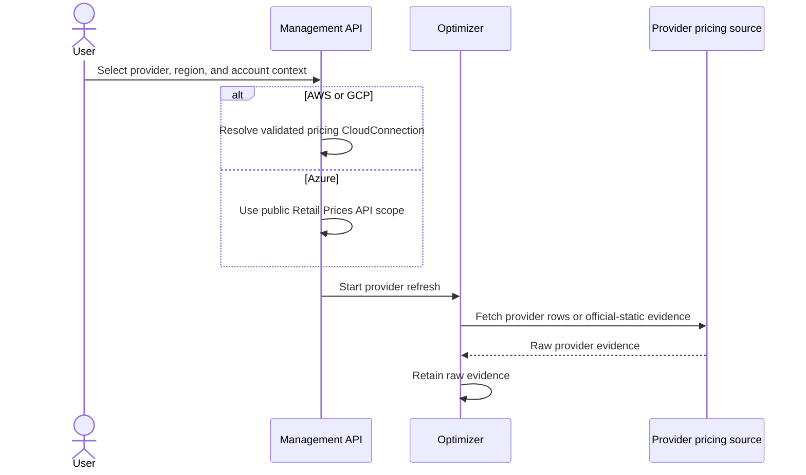
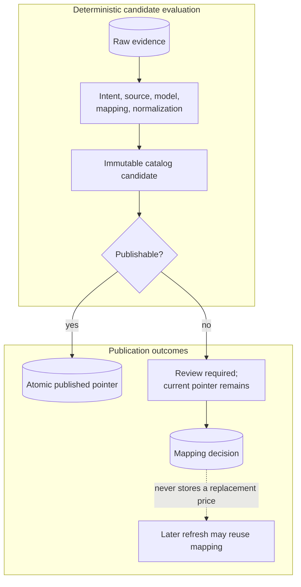
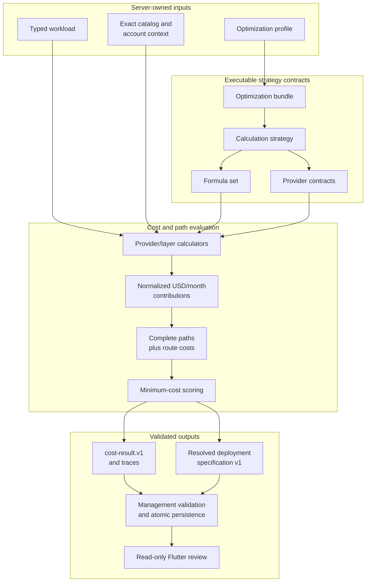
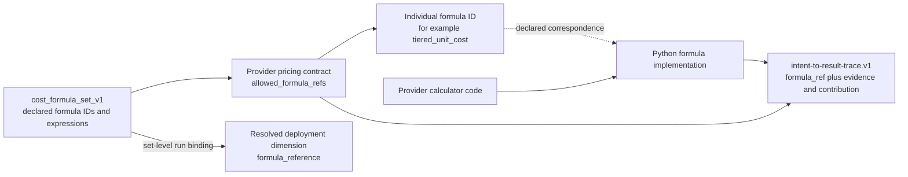

# Pricing And Optimization

## Pricing Refresh

### Acquisition

### Matching And Publication

The emergency fallback path is diagnostic. It is not a publishable pricing source and
must not silently enter cost calculation.

## Calculation And Path Selection

Provider-native billing quantities are not forced into one raw input unit. Contracts
normalize requests, messages, operations, bytes, GiB, GB, entity-months, query units,
or account bundles into cost contributions before complete paths are compared.

## Formula Assignment And Traceability

The similarly named fields have different meanings:

| Field | Meaning |
|---|---|
| `formula_set_id` | the approved formula collection selected by the calculation strategy |
| `formula_ref` in the field trace | the individual formula ID assigned by the provider pricing contract |
| `formula_reference` in a resolved deployment dimension | currently a set-level value such as `formula_set:cost_formula_set_v1`; it does not identify one individual formula |
| `evidence_reference` | the exact workload, catalog, deployment-registry, or provider-context evidence supporting the value |

## Current Enforcement Boundary

Provider-contract validation proves that every allowed formula ID exists in the
selected formula set. Provider calculators currently call their Python formula
functions directly, and trace construction records the formula allowed by the
contract. The transfer formula additionally passes a runtime
`ensure_formula_ref` check.

There is not yet one universal closed-world dispatcher that resolves every formula ID
to its Python implementation and proves that the invoked implementation is identical
to the trace ID. This is a current hardening gap, not a capability of the existing
system. Until it is closed, formula implementation, provider contract, traceability,
and cross-provider calculation tests must change together.

## Persistence Boundary

The Optimizer owns registry definitions and immutable catalogs. The Management API
owns durable owner-scoped refresh history, review decisions, calculation runs, result
items, exact catalog references, paths, traces, and resolved deployment
specifications. Flutter cannot author or overwrite these artifacts.

See [Optimizer](../components/optimizer.md) and
[Pricing Review](../user-guide/pricing-review.md) for operational detail.
