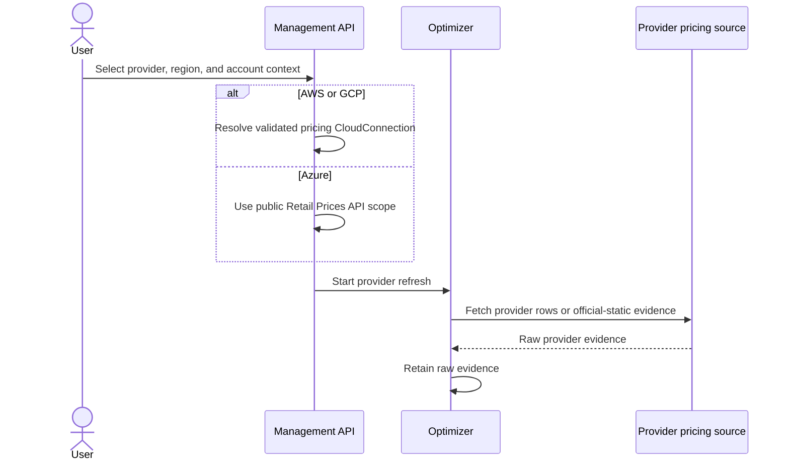
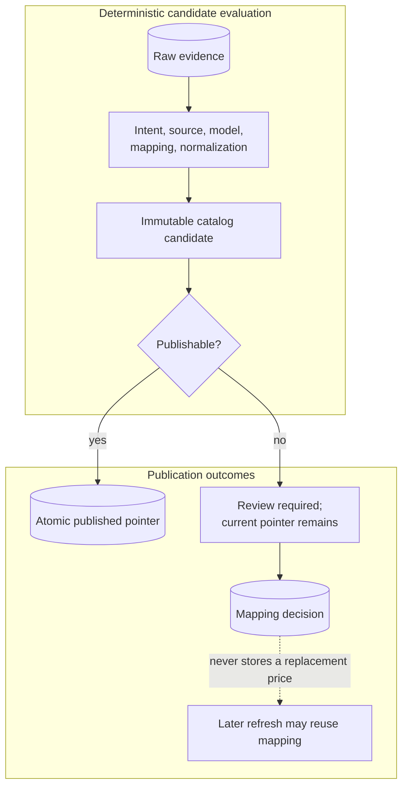
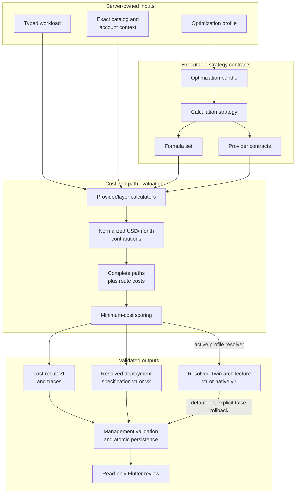
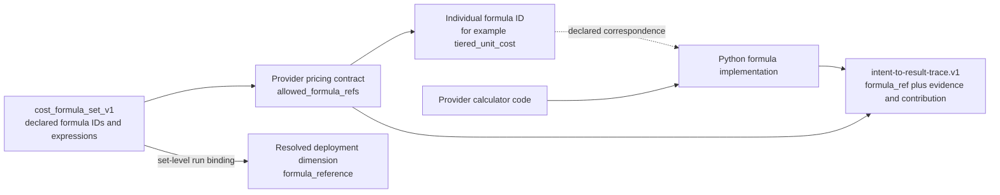

# Pricing And Optimization

## Pricing Refresh

### Acquisition

```mermaid
sequenceDiagram
    actor User
    participant API as Management API
    participant Optimizer
    participant Provider as Provider pricing source

    User->>API: Select provider, region, and account context
    alt AWS or GCP
        API->>API: Resolve validated pricing CloudConnection
    else Azure
        API->>API: Use public Retail Prices API scope
    end
    API->>Optimizer: Start provider refresh
    Optimizer->>Provider: Fetch provider rows or official-static evidence
    Provider-->>Optimizer: Raw provider evidence
    Optimizer->>Optimizer: Retain raw evidence
```

### Matching And Publication

```mermaid
flowchart TD
    subgraph Evaluation["Deterministic candidate evaluation"]
        direction LR
        Raw[("Raw evidence")] --> Contracts["Intent, source, model,<br/>mapping, normalization"]
        Contracts --> Candidate["Immutable catalog candidate"] --> Publishable{"Publishable?"}
    end

    subgraph Outcomes["Publication outcomes"]
        direction LR
        Published[("Atomic published pointer")]
        Review["Review required;<br/>current pointer remains"]
        Decision[("Mapping decision")]
        Later["Later refresh may reuse mapping"]
    end

    Publishable -->|"yes"| Published
    Publishable -->|"no"| Review --> Decision
    Decision -. "never stores a replacement price" .-> Later
```

The emergency fallback path is diagnostic. It is not a publishable pricing source and
must not silently enter cost calculation.

### Phase 8 profile offline publication

The active Six-layer v1 path consumes three immutable, content-addressed
provider snapshots published from `six_layer_rate_card_sources.v1.json`. The
publisher validates exact
provider/region/source/rate keys, official source hosts, observation time,
non-negative rates, and one shared pinned USD-to-EUR conversion before it
updates the canonical baseline. It also archives the predecessor baseline so
historical calculations keep a resolvable evidence chain.

These cards intentionally cover only the frozen Small, Medium, and Large thesis
workloads. Azure IoT Hub therefore uses exact prices for those three message
volumes instead of a linearized tier approximation. Azure Large Cosmos DB uses
the rounded 108,000-RU/s maximum of the storage floor and documented operation
estimates for offline cost comparison; this is not measured request-charge
evidence. The RDS keeps
the Cosmos request-charge and autoscale-capacity gates, and Management rejects
deployment selection until supervised evidence satisfies them.

Six-layer v1 prices the complete L1-L5 composition plus its registered Eventing
bundle, direct/bridge transfer, and destination-ingress dimensions. Its S/M/L
Eventing scenario is paired with the immutable core preset. The Phase 8
evidence covers all nine admissible L3/L5-to-L4 placements and all six directed
Event-provider pairs without claiming a cross-profile optimizer race.

Rollup storage and rollup operations are different quantities. Storage holds
at most one rollup item per device, metric, and hour (720 points across the
30-day hot window). Every accepted telemetry record still performs one raw
create, one rollup read, and one rollup update in the documented native
transaction. The offline ledger therefore bills operation counts per accepted
record and uses the bounded device-by-hour count only for stored rollup items
and their eventual deletion.

## Calculation And Path Selection

```mermaid
flowchart TD
    subgraph Inputs["Server-owned inputs"]
        direction LR
        Workload["Typed workload"]
        Context["Exact catalog and<br/>account context"]
        Profile["Optimization profile"]
    end

    subgraph Contracts["Executable strategy contracts"]
        direction LR
        Bundle["Optimization bundle"] --> Strategy["Calculation strategy"]
        Strategy --> FormulaSet["Formula set"]
        Strategy --> ProviderContracts["Provider contracts"]
    end

    subgraph Evaluation["Cost and path evaluation"]
        direction LR
        Calculators["Provider/layer calculators"] --> Contributions["Normalized USD/month<br/>contributions"]
        Contributions --> Paths["Complete paths<br/>plus route costs"] --> Scoring["Minimum-cost scoring"]
    end

    subgraph Outputs["Validated outputs"]
        direction LR
        Result["cost-result.v1<br/>and traces"]
        Specification["Resolved deployment<br/>specification v1 or v2"]
        Architecture["Resolved Twin architecture<br/>v1 or native v2"]
        Management["Management validation<br/>and atomic persistence"]
        Flutter["Read-only Flutter review"]
    end

    Profile --> Bundle
    Workload --> Calculators
    Context --> Calculators
    FormulaSet --> Calculators
    ProviderContracts --> Calculators
    Scoring --> Result
    Scoring --> Specification
    Scoring -->|"active profile resolver"| Architecture
    Result --> Management
    Specification --> Management --> Flutter
    Architecture -->|"default-on; explicit false rollback"| Management
```

Provider-native billing quantities are not forced into one raw input unit. Contracts
normalize requests, messages, operations, bytes, GiB, GB, entity-months, query units,
or account bundles into cost contributions before complete paths are compared.

## Formula Assignment And Traceability

```mermaid
flowchart LR
    FormulaSet["cost_formula_set_v1<br/>declared formula IDs and expressions"]
    Contract["Provider pricing contract<br/>allowed_formula_refs"]
    FormulaID["Individual formula ID<br/>for example tiered_unit_cost"]
    Calculator["Provider calculator code"]
    Implementation["Python formula implementation"]
    Trace["intent-to-result-trace.v1<br/>formula_ref plus evidence and contribution"]
    Dimension["Resolved deployment dimension<br/>formula_reference"]

    FormulaSet --> Contract --> FormulaID
    FormulaID -. "declared correspondence" .-> Implementation
    Calculator --> Implementation --> Trace
    Contract --> Trace
    FormulaSet -->|"set-level run binding"| Dimension
```

The similarly named fields have different meanings:

| Field | Meaning |
|---|---|
| `formula_set_id` | the approved formula collection selected by the calculation strategy |
| `formula_ref` in the field trace | the individual formula ID assigned by the provider pricing contract |
| `formula_reference` in a resolved deployment dimension | currently a set-level value such as `formula_set:cost_formula_set_v1`; it does not identify one individual formula |
| `evidence_reference` | the exact workload, catalog, deployment-registry, or provider-context evidence supporting the value |

## Current Enforcement Boundary

Provider-contract validation proves that every allowed formula ID exists in the
selected formula set. Provider calculators currently call their Python formula
functions directly, and trace construction records the formula allowed by the
contract. The transfer formula additionally passes a runtime
`ensure_formula_ref` check.

There is not yet one universal closed-world dispatcher that resolves every formula ID
to its Python implementation and proves that the invoked implementation is identical
to the trace ID. This is a current hardening gap, not a capability of the existing
system. Until it is closed, formula implementation, provider contract, traceability,
and cross-provider calculation tests must change together.

## Persistence Boundary

The Optimizer owns registry definitions and immutable catalogs. The Management API
owns durable owner-scoped refresh history, review decisions, calculation runs, result
items, exact catalog references, paths, traces, and resolved deployment
specifications. It also owns the selected architecture-profile reference and
immutable resolved-architecture persistence. Phase 8.5 implements architecture
emission, trusted Management enrichment, shared-contract validation, and
atomic result/specification/architecture persistence. The active
`six-layer-eventing@1` path is default-on; explicit `false` is a fail-closed
rollback. The public Management calculation schema cannot author the profile
or extension references. Offline v2 evidence remains unselectable for
deployment while any supervised live-capacity gate is listed. Flutter cannot
author or overwrite these artifacts.

See [Optimizer](../components/optimizer.md) and
[Pricing Review](../user-guide/pricing-review.md) for operational detail.
