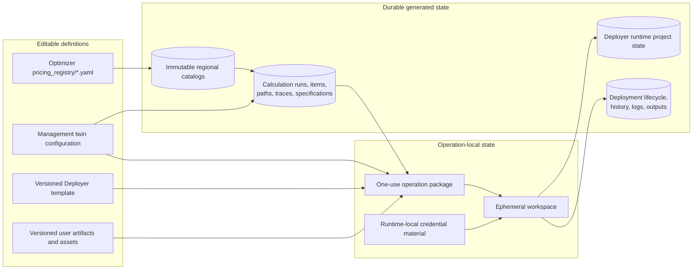
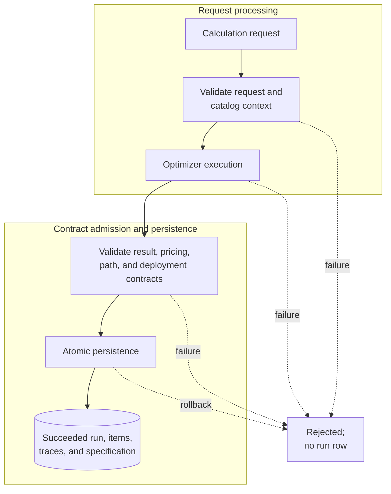
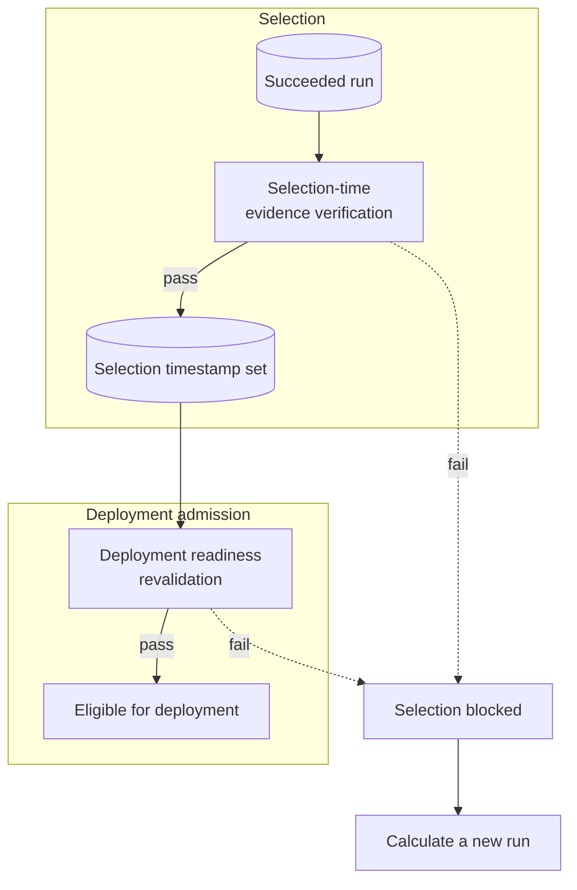
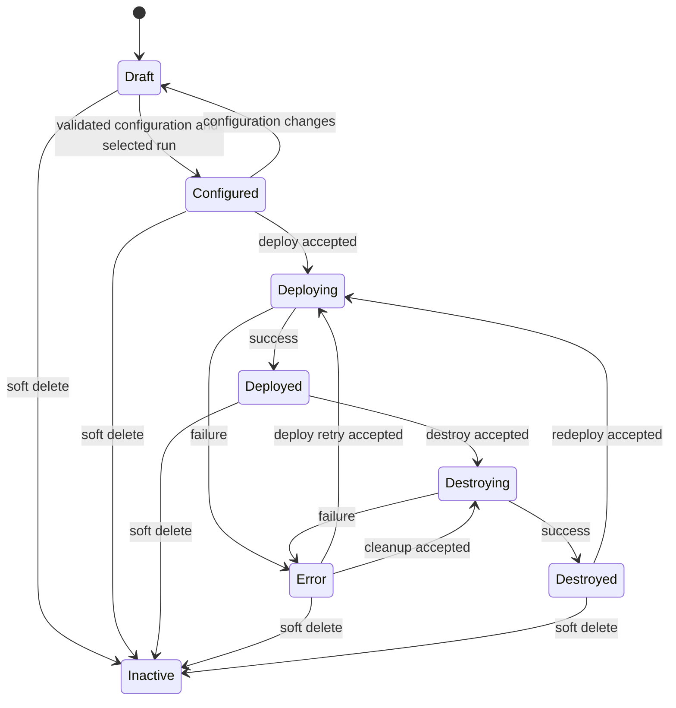

# State Ownership

## Systems Of Record

## Ownership Matrix

| State | System of record | Mutability | Main consumers |
|---|---|---|---|
| users, sessions, twins, lifecycle | Management database | transactional | Management API, Flutter |
| reusable cloud credentials | encrypted Management `cloud_connections` | owner-scoped transactional | credential resolver |
| wizard/configuration state | Management configuration tables and versions | transactional and lifecycle-invalidating | Flutter, run/deployment builders |
| pricing intents, mappings, formulas, models, routes | versioned Optimizer YAML registry | reviewed source change | refresh, calculation, validation |
| regional pricing catalogs | Optimizer immutable catalog store | append-only snapshots plus atomic active pointer | Management context resolution, calculation |
| pricing refresh/review history | Management database | append/update by workflow | Flutter pricing review |
| calculation results and specifications | Management database | immutable after successful run creation | Flutter, deployment selection |
| operation package | Deployer package store | immutable, one acquisition | deploy/destroy operation |
| operation workspace | Deployer temporary storage | mutable only during one operation | Terraform and provider adapters |
| runtime project state and allowlisted outputs | Deployer runtime store | operation-controlled | destroy, status, verification |
| deployment history/logs | Management database | append/update by operation | Flutter REST/SSE |

## Calculation Run Lifecycle

### Atomic Run Creation

### Selection And Deployment Readiness

This diagram combines request processing with the durable run lifecycle. The
Management API currently persists only fully validated successful runs with
`status=succeeded`; rejected requests do not create a pending or failed run row.
Selection is represented by `selected_for_deployment_at`, not by changing the run
status. Staleness and incompatibility are evaluated at selection and deployment
readiness rather than written back as a mutable run status.

Historical successful runs remain inspectable. A run becomes deployable only when
its schema, catalog/account context, path evidence, and resolved specification remain
valid. Creating a newer run does not automatically select it; selecting another run
clears the previous run's selection timestamp.

## Deployment State Transition

`TwinLifecycleService` owns lifecycle transitions. Routes, Flutter, Optimizer, and
Deployer may request or report actions but must not invent state transitions.

See [State And Persistence](../runtime/state-and-persistence.md).
