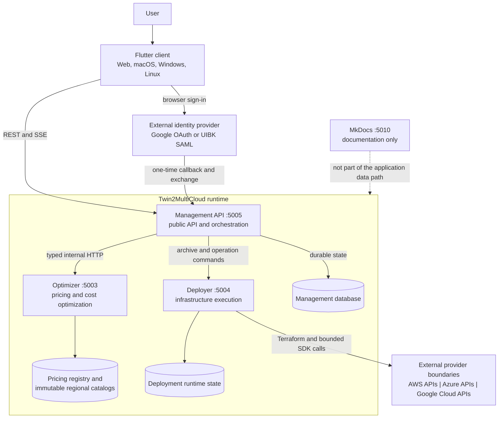
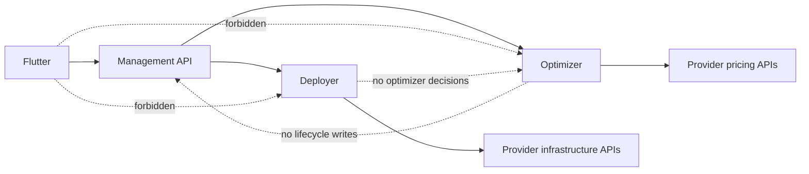

# System Boundaries

## Runtime Landscape

## Project Responsibilities

| Project | Owns | Must not own |
|---|---|---|
| Flutter | presentation, local interaction state, typed Management API adapters | durable optimizer results, provider pricing logic, direct Optimizer/Deployer calls |
| Management API | users, twins, configuration, CloudConnections, durable runs, lifecycle orchestration, public contract shaping | provider formula implementation, Terraform resource execution |
| Optimizer | pricing acquisition, immutable catalogs, pricing registry, formula execution, path scoring, resolved deployment specification production | user identity, twin lifecycle persistence, cloud deployment |
| Deployer | package validation, typed infrastructure translation, isolated workspaces, Terraform and bounded SDK operations | optimization decisions, pricing selection, application user state |
| Docs | canonical user/developer documentation | runtime application state |

## Allowed Network Direction

The locally published Optimizer and Deployer ports are diagnostics and internal
service endpoints. Their presence does not make them supported Flutter dependencies.

## Related Detail

- [System Context](../architecture/system-context.md)
- [Responsibilities And Data Ownership](../architecture/data-ownership.md)
- [Project Structure](../developer-guide/project-structure.md)
