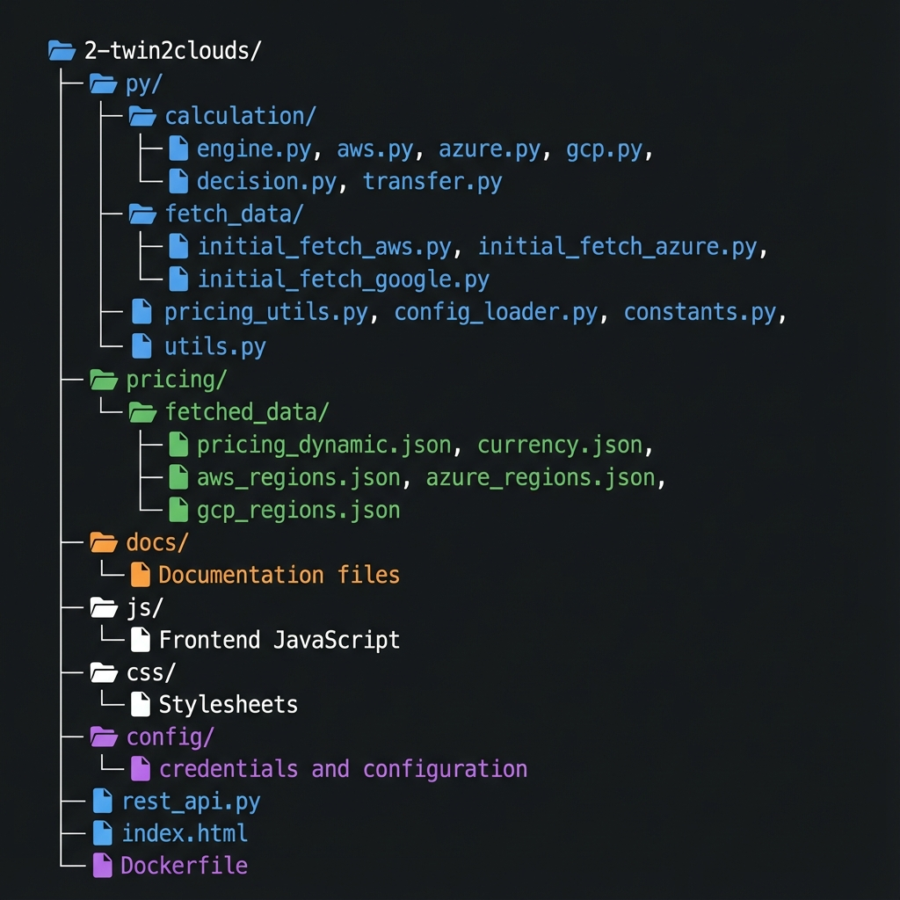

# Project Structure

```text
master-thesis/
|-- thesis.sh                    canonical local entrypoint
|-- compose.yaml                 credential-free application stack
|-- compose.cloud.local.yaml     opt-in local cloud credential overlay
|-- bootstrap/                   versioned provider identity scripts
|-- docs-site/                   canonical documentation
|-- docs/plans/                  accepted concepts/implementation plans
|-- twin2multicloud_flutter/     Flutter UI
|-- twin2multicloud_backend/     Management API and SQLite domain state
|-- 2-twin2clouds/               Optimizer and pricing registry
|-- 3-cloud-deployer/            infrastructure execution engine
`-- twin2multicloud-latex/       separate thesis source (not app runtime)
```



The image preserves the project lineage. The authoritative current boundaries are the
text and diagrams in [System Context](../architecture/system-context.md).

## Where A Change Belongs

| Change | Owner |
|---|---|
| screen, navigation, interaction state | Flutter |
| user/twin/config/history lifecycle | Management API |
| cloud credential persistence and ownership | Management API |
| pricing catalog matching/normalization/formulas | Optimizer |
| provider resources, Terraform, function packaging | Deployer |
| published explanation | docs site |

Cross-project contract changes require consumer and provider tests in the same slice.
