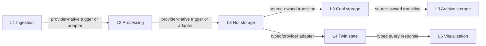

<!-- SOURCES:
- contracts/architecture-inventory/v1/current-graph.json
- contracts/architecture-inventory/v1/five-layer-baseline-v1-decision.json
- docs/research/phase_08_current_function_edge_matrix.md
- docs/research/digital_twin_architecture_and_eventing_layer.md
- docs/research/research_questions_and_evaluation_design.md
- docs/plans/phase_08_architecture_profiles_eventing/README.md
EXTRACTED: 2026-07-29 | VERSION: 1.3
-->

# Five-Layer Baseline Target Decision

## Decision

`five-layer-baseline@1` has exactly five scientific responsibilities:
ingestion, processing, storage, Twin state, and visualization. The three
storage classes remain separate optimization and cost slots, but remain one
scientific storage layer. Platform orchestration and cross-provider adapters
are implementation support, not extra Twin layers.

The baseline has no general Eventing responsibility or Eventing cost owner.
Provider-native triggers remain permissible only as intrinsic details of an
approved component or edge. The optional event-check and feedback topology is
not currently executable as a complete reviewed path and is therefore
explicitly excluded rather than silently represented as supported.

### Lifecycle Addendum

The decision and its digests remain immutable historical/paper-compatible
evidence in the Optimizer. It is not published through Management, Deployer,
Terraform, or Flutter and is not a target for new deployment operations. The
standalone `six-layer-eventing@1` profile owns the current complete service
bundles and runtime behavior.
Existing `@1` records remain read/verify/destroy compatible and are never
rewritten.

This is a historical target decision, not current runtime documentation.
Phases 8.2-8.7 materialize its compatibility mapping and reusable dark
foundations. Only Phase 8.9 may register and activate complete new-profile
provider candidates from the separate complete-service decision.

## Current Versus Target

| Concern | Phase 8.0 current graph | Phase 8.1 target |
|---|---|---|
| Scientific model | Five paper layers plus implementation responsibilities | Exactly five scientific responsibilities |
| Cost model | Seven ordered optimizer slots plus transition and transfer owners | Seven slots preserved; costs remain traceable without creating extra layers |
| Component selection | 114 inventoried implementation records | 114 explicit retain/remove decisions |
| Edge selection | 90 runtime and deployment edges | 90 explicit target mechanisms |
| Visualization binding | AWS/Azure Grafana binds a provider-local L3 hot reader | A typed L4-to-L5 query contract is mandatory |
| Mixed L4-to-L5 | Priced by the Optimizer but not deployable | Fail-closed until Phase 8.6 resolves declared outputs |
| Optional event path | Packages exist without an approved executable topology | Explicitly unsupported in the baseline |
| Resource identity | Some post-deployment conventions and suffixes | Declared component output, platform binding, or profile constant only |

## Target Flow

The six arrows are functional and cost relationships. They do not imply six
remote function calls. A provider lifecycle feature may replace an explicit
transition runtime only when timing, destination semantics, cross-provider
behavior, observability, and cost ownership remain equivalent.

## L4-To-L5 Resolution

The predecessor graph exposed one concrete contradiction:

- the Optimizer prices an L4-to-L5 result flow;
- the current AWS and Azure Deployer code binds Grafana directly to a
  provider-local L3 hot-reader URL;
- a mixed path can therefore be cost-ranked even when no matching datasource
  binding exists.

The target keeps L4-to-L5 as the normative scientific and cost edge. It removes
the direct L3-hot-to-L5 edge from the executable target and requires a typed
request/response contract with a bounded timeout, idempotent retry rules,
authentication, correlation, and a declared output binding. Phase 8.6 owns the
runtime resolver and preflight. Until then all-AWS, all-Azure, and mixed
complete paths are marked `PROFILE_TARGET_NOT_IMPLEMENTED`, not supported.

This decision means there is no new Event Layer in the Twin. It repairs the
boundary between Twin state and visualization.

## Component Decisions

The machine-readable decision covers all 114 current implementation records:

- 101 records are retained as scientific implementations or platform support;
- 13 records are removed from the executable baseline;
- removed records comprise provider event-check/feedback implementations,
  event-action templates, and GCP L4 connector sources that are present but
  excluded from the registry;
- historical source remains available as compatibility evidence; Phase 8.1
  performs no source or Terraform deletion.

The optional error-handling path is excluded because no current evidence proves
a complete approved topology. Its L2 cost ownership does not disappear: the
mandatory processing formula remains attached to the retained processing
responsibility. User processor wrappers remain compatibility inputs, but no
extension slot may become executable before issue #113 completes.

## Edge Decisions

All 90 current edges receive one mechanism:

| Mechanism | Count | Use |
|---|---:|---|
| `in_process_port` | 45 | Deterministic deployment compilation and package binding |
| `provider_native_trigger` | 14 | Intrinsic provider flow without a general Eventing layer |
| `source_owned_transition_runtime` | 14 | Hot-to-cool and cool-to-archive behavior |
| `remove` | 8 | Excluded optional paths and direct L3-to-L5 shortcuts |
| `typed_synchronous_api` | 5 | Immediate-response platform and L4-to-L5 boundaries |
| `cross_provider_adapter` | 4 | Current explicit cross-provider transfer boundaries |

No retained target edge may obtain another component's identity from a
constructed resource name, suffix lookup, or duplicated string convention.

## Provider Admissibility

| Candidate | Decision | Reason |
|---|---|---|
| All AWS | Blocked until target implementation | Five responsibilities are represented, but typed L4-to-L5 deployment binding is pending |
| All Azure | Blocked until target implementation | Five responsibilities are represented, but typed L4-to-L5 deployment binding is pending |
| All GCP | Unsupported | No approved deployable L4 Twin-state or L5 visualization bundle |
| Mixed provider | Blocked until target implementation | Existing L1-L4 adapters do not provide a cross-provider L4-to-L5 binding |

No candidate is labeled supported merely because its services can be priced.
Functional completeness and deployability precede cost ranking.

## Cost Ownership

All 12 Phase 8.0 cost owners remain covered:

- L1, L2, L4, and L5 map to their corresponding scientific responsibility;
- hot, cool, archive, and transition-runtime costs map to L3 storage while
  preserving separate formulas and optimization slots;
- cross-provider transfer remains edge-owned;
- platform orchestration remains outside the Optimizer Twin total;
- user-extension execution remains part of processing cost evidence.

The decision neither changes prices nor introduces a new cost formula.

## Alternatives Rejected

1. Retaining the current L3-hot-to-Grafana binding was rejected because it
   contradicts the modeled L4-to-L5 flow and cannot represent arbitrary mixed
   L4/L5 selections.
2. Adding a broker or queue to every inherited helper edge was rejected because
   the baseline has no general fan-out, replay, or independent-consumer
   requirement.
3. Treating hot, cool, and archive storage as three scientific layers was
   rejected because their separation is a deployment and cost concern within
   L3.
4. Marking all-GCP complete because L1-L3 services are priceable was rejected
   because mandatory L4 and L5 deployment capabilities are absent.
5. Finalizing user extension bindings in this phase was rejected because issue
   #113 owns the deterministic packaging and extension boundary.

## Residual Limitations And Threats To Validity

- The decision is derived from the Phase 8.0 source inventory. A changed source
  digest invalidates it.
- Provider admissibility is an offline architecture decision; no live provider
  deployment was run.
- The historical `@1` L4-to-L5 contract is not evidence of a deployed
  datasource, and the dark Phase 8.6 compiler does not repair that runtime.
- GCP L4/L5 support is absent from this historical `@1` evidence. The separate
  complete-service decision selects an explicit provider-hosted bundle only
  for the new profiles.
- The `@1` removal of the uncontracted L3-to-L5 shortcut remains frozen
  historical evidence. The standalone Six-layer profile defines its own typed
  raw-history and Twin-projection edges without rewriting the `@1` decision.
- The optional error path remains visible but unsupported. A later profile may
  reintroduce it only through a separate reviewed contract.
- Current fixed seven-slot compatibility remains during migration. It is not a
  general-purpose graph-authoring interface.

## Reproducibility

The decision JSON records the exact Phase 8.0 `content_digest`, uses canonical
sorted JSON, and has its own deterministic SHA-256 digest. The checker rejects
missing decisions, stale inventory, unresolved target references, missing
functional or cost proofs, incomplete provider bundles, implicit resource
bindings, Eventing scope leakage, and digest drift.

<!-- five-layer-baseline-decision-ids:
responsibility.ingestion
responsibility.processing
responsibility.storage
responsibility.twin-state
responsibility.visualization
target.edge.runtime.aws.l1-to-l2
target.edge.runtime.aws.l2-to-l3-hot
target.edge.runtime.aws.l3-cool-to-l3-archive
target.edge.runtime.aws.l3-hot-to-l3-cool
target.edge.runtime.aws.l3-hot-to-l4
target.edge.runtime.aws.l4-to-l5
target.edge.runtime.azure.l1-to-l2
target.edge.runtime.azure.l2-to-l3-hot
target.edge.runtime.azure.l3-cool-to-l3-archive
target.edge.runtime.azure.l3-hot-to-l3-cool
target.edge.runtime.azure.l3-hot-to-l4
target.edge.runtime.azure.l4-to-l5
target.edge.runtime.gcp.l1-to-l2
target.edge.runtime.gcp.l2-to-l3-hot
target.edge.runtime.gcp.l3-cool-to-l3-archive
target.edge.runtime.gcp.l3-hot-to-l3-cool
target.edge.runtime.mixed.l1-to-l2
target.edge.runtime.mixed.l2-to-l3-hot
target.edge.runtime.mixed.l3-cool-to-l3-archive
target.edge.runtime.mixed.l3-hot-to-l3-cool
target.edge.runtime.mixed.l3-hot-to-l4
target.edge.runtime.mixed.l4-to-l5
-->
