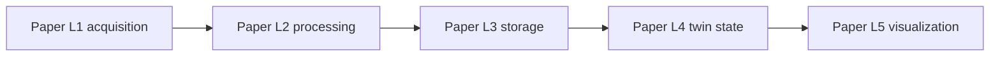
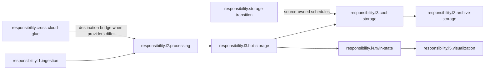
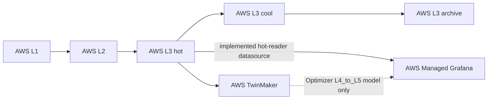
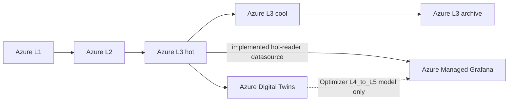
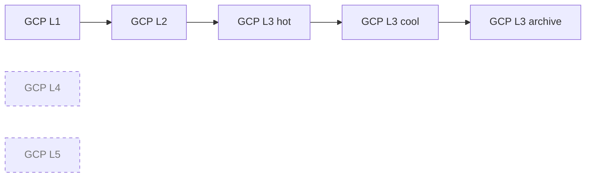
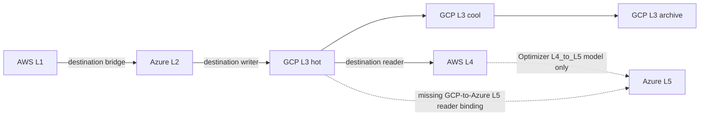
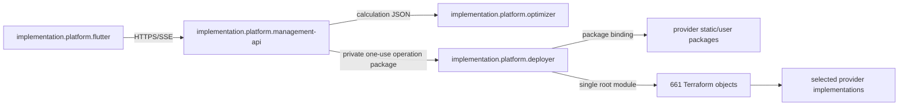
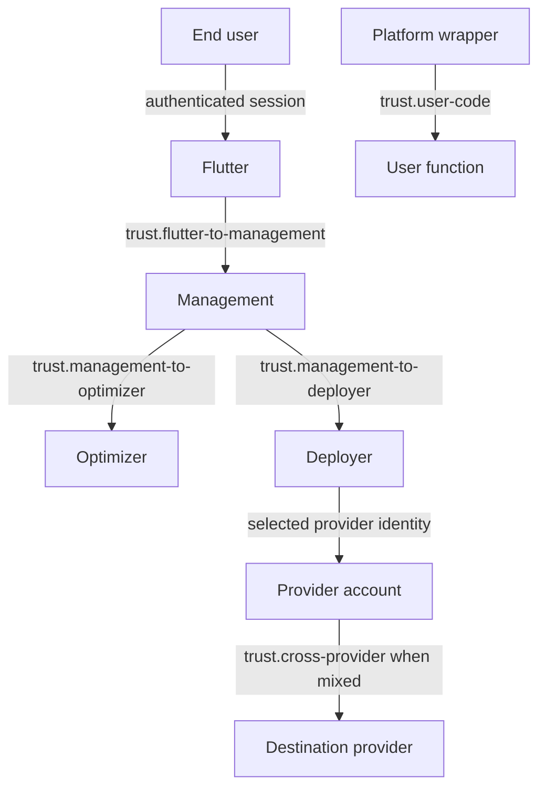
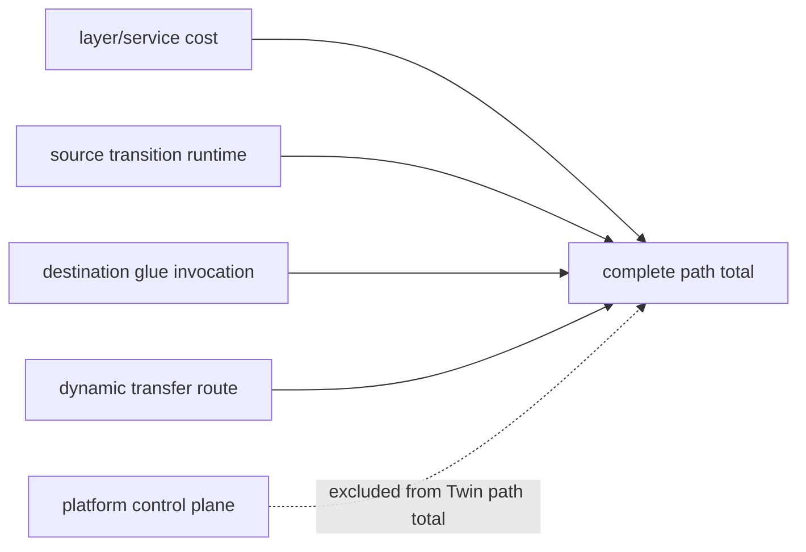

# Phase 8.0 Current Function-and-Edge Matrix

Status: implemented and code-verified for issue
[#144](https://github.com/TVJunkie724/master-thesis/issues/144). This is an
inventory of inherited behavior, not an approval decision.

Machine-readable source of truth:
[`current-graph.json`](../../contracts/architecture-inventory/v1/current-graph.json).
Contract and regeneration rules:
[`README.md`](../../contracts/architecture-inventory/v1/README.md).

<!-- architecture-inventory-diagram-ids:
edge.runtime.aws.l1-to-l2
edge.runtime.aws.l2-to-l3-hot
edge.runtime.aws.l3-cool-to-l3-archive
edge.runtime.aws.l3-hot-to-l3-cool
edge.runtime.aws.l3-hot-to-l4
edge.runtime.aws.l4-to-l5
edge.runtime.aws.l3-hot-to-l5-reader
edge.runtime.azure.l1-to-l2
edge.runtime.azure.l2-to-l3-hot
edge.runtime.azure.l3-cool-to-l3-archive
edge.runtime.azure.l3-hot-to-l3-cool
edge.runtime.azure.l3-hot-to-l4
edge.runtime.azure.l4-to-l5
edge.runtime.azure.l3-hot-to-l5-reader
edge.runtime.gcp.l1-to-l2
edge.runtime.gcp.l2-to-l3-hot
edge.runtime.gcp.l3-cool-to-l3-archive
edge.runtime.gcp.l3-hot-to-l3-cool
edge.runtime.mixed.l1-to-l2
edge.runtime.mixed.l2-to-l3-hot
edge.runtime.mixed.l3-cool-to-l3-archive
edge.runtime.mixed.l3-hot-to-l3-cool
edge.runtime.mixed.l3-hot-to-l4
edge.runtime.mixed.l4-to-l5
implementation.catalog.l1-aws-iot-core
implementation.catalog.l1-azure-iot-hub
implementation.catalog.l1-gcp-pubsub
implementation.catalog.l2-aws-processing-lambdas
implementation.catalog.l2-azure-function-plan
implementation.catalog.l2-gcp-processing-functions
implementation.catalog.l3-archive-aws-s3
implementation.catalog.l3-archive-azure-blob-storage
implementation.catalog.l3-archive-gcp-cloud-storage
implementation.catalog.l3-cool-aws-s3
implementation.catalog.l3-cool-azure-blob-storage
implementation.catalog.l3-cool-gcp-cloud-storage
implementation.catalog.l3-hot-aws-dynamodb
implementation.catalog.l3-hot-azure-cosmos-db
implementation.catalog.l3-hot-gcp-firestore
implementation.catalog.l4-aws-twinmaker
implementation.catalog.l4-azure-digital-twins
implementation.catalog.l5-aws-managed-grafana
implementation.catalog.l5-azure-managed-grafana
implementation.platform.deployer
implementation.platform.flutter
implementation.platform.management-api
implementation.platform.optimizer
responsibility.cross-cloud-glue
responsibility.l1.ingestion
responsibility.l2.processing
responsibility.l3.archive-storage
responsibility.l3.cool-storage
responsibility.l3.hot-storage
responsibility.l4.twin-state
responsibility.l5.visualization
responsibility.storage-transition
trust.cross-provider
trust.flutter-to-management
trust.management-to-deployer
trust.management-to-optimizer
trust.provider-account
trust.user-code
-->

## Audit result

| Entity | Verified count |
|---|---:|
| Logical responsibilities | 11 |
| Provider/platform implementations | 114 |
| Package, template, wrapper, and source artifacts | 64 |
| Terraform resources, data sources, outputs, variables, and locals | 661 |
| Runtime and deployment binding edges | 90 |
| Cost owners | 12 |
| Trust boundaries | 6 |
| Fixed assumptions | 7 |
| Explicit predecessor findings | 1 |

Inventory content digest:
`sha256:02a97aa7acff6382f51527012df85a7b0c3680d715c3c89edef0792e6775a5c2`.
The source drift gate is the checker, not this copied value.

## Model reconciliation

The paper has five scientific layers. The executable path has seven Optimizer
slots because paper L3 is split into hot, cool, and archive storage. Historical
Deployer `L0` names are cross-provider implementation glue, not a sixth paper
layer. Management API, Deployer, and Flutter are control-plane/platform
components and are not silently inserted into the scientific model.

| Scientific model | Optimizer/deployment slot | Current responsibility ID |
|---|---|---|
| L1 | `l1_ingestion` / `L1` | `responsibility.l1.ingestion` |
| L2 | `l2_processing` / `L2` | `responsibility.l2.processing` |
| L3 | `l3_hot_storage` / `L3_hot` | `responsibility.l3.hot-storage` |
| L3 | `l3_cool_storage` / `L3_cool` | `responsibility.l3.cool-storage` |
| L3 | `l3_archive_storage` / `L3_archive` | `responsibility.l3.archive-storage` |
| L4 | `l4_twin_state` / `L4` | `responsibility.l4.twin-state` |
| L5 | `l5_visualization` / `L5` | `responsibility.l5.visualization` |
| none | transition runtime | `responsibility.storage-transition` |
| none | historical L0 glue | `responsibility.cross-cloud-glue` |

The predecessor/paper model remains the five scientific layers:



```text
paper: L1 acquisition -> L2 processing -> L3 storage -> L4 twin -> L5 visualization
```

The current executable responsibility graph refines paper L3 into three
Optimizer/deployment slots:



Plain-text equivalent:

```text
L1 acquisition -> L2 processing -> L3 hot -> L3 cool -> L3 archive
                                      |
                                      +-------> L4 twin -> L5 visualization
storage-transition owns hot->cool and cool->archive schedules
cross-cloud-glue appears only where selected providers differ
```

## Function matrix

The live `STATIC_FUNCTIONS` registry has 20 logical entries and 54 provider
implementation records. A registry relationship is not inferred from a
directory name.

| Registry name | Historical layer | Lifecycle/edge role | Provider evidence |
|---|---|---|---|
| `ingestion` | L0 | destination bridge for L1 to L2 | AWS, Azure, GCP |
| `hot-writer` | L0 | destination writer for L2 to hot | AWS, Azure, GCP |
| `cold-writer` | L0 | optional destination writer for hot to cool | AWS, Azure, GCP |
| `archive-writer` | L0 | optional destination writer for cool to archive | AWS, Azure, GCP |
| `adt-pusher` | L0 | Azure-target L4 bridge | Azure |
| `l0-hot-reader` | L0 | destination reader for L4 to hot | AWS, Azure, GCP |
| `l0-hot-reader-last-entry` | L0 | destination last-entry reader for L4 to hot | AWS, Azure, GCP |
| `dispatcher` | L1 | provider ingestion dispatch | AWS, Azure, GCP |
| `connector` | L1 | L1-to-L2 cross-provider connector | AWS, Azure, GCP |
| `persister` | L2 | processing result persistence | AWS, Azure, GCP |
| `event-checker` | L2 | feature-gated event check | AWS, Azure, GCP |
| `event-feedback` | L2 | feature-gated user extension | User package on selected provider |
| `processor_wrapper` | L2 | platform wrapper around per-device user processor | AWS, Azure, GCP |
| `event_feedback_wrapper` | L2 | platform wrapper around user event feedback | AWS, Azure, GCP |
| `hot-reader` | L3 | hot-store query | AWS, Azure, GCP |
| `hot-reader-last-entry` | L3 | last-entry hot-store query | AWS, Azure, GCP |
| `hot-to-cold-mover` | L3 | source-owned daily transition | AWS, Azure, GCP |
| `cold-to-archive-mover` | L3 | source-owned weekly transition | AWS, Azure, GCP |
| `digital-twin-data-connector` | L4 | AWS TwinMaker connector | AWS |
| `digital-twin-data-connector-last-entry` | L4 | AWS TwinMaker last-entry connector | AWS |

Three deliberate source/registry distinctions are fully evidenced:

- AWS and GCP `default-processor` trees are user-package bases, not static
  registry functions.
- GCP source trees for the two digital-twin connectors exist but are excluded
  by the live registry and by the unsupported GCP L4 capability. They are
  inventoried as `unsupported`, not presented as deployable.
- `event-feedback` is historically in `STATIC_FUNCTIONS`, but its handler is
  user-owned and built from the selected operation package. The absence of a
  platform handler is therefore an explicit ownership boundary, not a missing
  artifact.

## Provider graphs

AWS and Azure have current catalog implementations for all seven slots. GCP
has implementations through L3 archive; its L4 and L5 deployment capabilities
are explicitly unsupported.



```text
AWS: IoT Core -> Lambda processing -> DynamoDB -> S3 cool -> S3 archive
                                      +-> TwinMaker -.-(modeled)-> Managed Grafana
                                      \-> hot reader -----------> Managed Grafana
```



```text
Azure: IoT Hub -> Functions processing -> Cosmos DB -> Blob cool -> Blob archive
                                            +-> Digital Twins -.-(modeled)-> Managed Grafana
                                            \-> hot reader -------------> Managed Grafana
```



```text
GCP: Pub/Sub -> Cloud Functions processing -> Firestore -> Cloud Storage cool -> archive
     L4 unsupported; L5 unsupported
```

The resolved contract accepts the following representative mixed cost
candidate, but its L5 segment is not currently deployment-complete:



```text
AWS L1 => Azure L2 => GCP hot => GCP cool => GCP archive
                           \=> AWS L4 -x-> Azure L5
=> denotes an implemented provider boundary; -x-> is accepted by the cost/
contract path but lacks an executable L5 reader binding.
```

## Deployment and package bindings



```text
Flutter -> Management API -> Optimizer
                         \-> Deployer -> packages + one Terraform root -> cloud components
Credentials remain in the private, short-lived Management-to-Deployer operation boundary.
```

Package evidence comprises 51 buildable registered static handlers, six
user templates, two provider `default-processor` bases, two registry-excluded
GCP source artifacts, and three provider shared-wrapper libraries: 64
canonical artifact records.

## Trust and credential boundaries



```text
user | Flutter | Management | Optimizer
                 |
                 + private operation package
                 v
              Deployer | provider account | remote provider
platform wrapper | user code
```

No credential value, endpoint, account ID, runtime resource name, Terraform
state path, or generated package content is stored in the inventory.

## Cost and transfer ownership



```text
complete path total =
  layer services
  + source-owned transition schedules/functions
  + destination-owned bridge/writer functions
  + dynamically resolved provider transfer routes
Management/Deployer/Flutter account cost is explicit but outside the Optimizer Twin total.
```

Transfer route IDs are resolved against the pricing registry at calculation
time. The inventory therefore records a dynamic route intent for mixed edges
instead of inventing a physical route or copying an account-specific value.

## Explicit predecessor finding

`finding.l5-reader-binding-divergence` is fully evidenced and remains open for
the Phase 8.1 baseline decision and Phase 8.6 graph resolver:

- the Optimizer prices a logical `L4_to_L5` query-result edge;
- AWS and Azure post-deployment code actually configures Grafana against the
  same-provider L3 hot-reader output;
- the Deployer glue policy has no L3-hot-to-L5 or L4-to-L5 cross-provider
  binding;
- a resolved path with L5 different from L3 hot can therefore pass contract
  validation but fail after apply or bind no selected reader.

The inventory records the two implemented direct edges as
`edge.runtime.aws.l3-hot-to-l5-reader` and
`edge.runtime.azure.l3-hot-to-l5-reader`. The three modeled
`*.l4-to-l5` edges are classified `unsafe_debt`; they are not presented as
deployed runtime behavior. Phase 8.0 cannot repair this because runtime changes
are expressly forbidden.

## Fixed assumptions passed to later phases

1. Seven-slot order and seven `cheapest_l*` columns are fixed consumers until
   Phases 8.4 and 8.7 migrate them.
2. Seven `layer_*_provider` keys remain the Deployer projection contract.
3. Function output suffixes and provider handler paths are registry-owned.
4. User functions remain provider-selected operation-package inputs.
5. Flutter architecture graphs and configuration labels are fixed-slot
   presentations until Phase 8.7.
6. In this predecessor inventory, GCP L4/L5 remains unsupported; source
   presence is not capability evidence. A later provider-hosted target does
   not rewrite this historical finding.
7. The inventory contains no retain/replace/remove decision. Phase 8.1 owns
   that decision for every implementation and edge.

## Verification

The Phase 8.0 evidence cut validated Draft 2020-12 schema closure, canonical
and source-tree digests, global IDs, logical/provider identity agreement,
references, all 20 registry functions, all 661 parsed HCL objects,
package/template sources, 42 deployment catalog components, seven Optimizer
slots, six baseline edges, and 93 bounded Management/Flutter fixed-field
anchors across 19 source consumers.

Phase 8.4 subsequently added the server-owned
`resolved_architecture_service.py` compatibility projection to that executable
allowlist. The Phase 8.6 migration has since reduced the remaining executable
legacy surface; the current drift gate verifies 88 anchors across 14 source
files, as tracked in
[`README.md`](../plans/phase_08_architecture_profiles_eventing/README.md);
the Phase 8.0 count above remains the historical cut rather than being silently
rewritten.

```bash
python3 scripts/check_architecture_inventory.py
```

Live provider APIs, Terraform apply/destroy, and thesis rendering are outside
this audit and were not executed.
