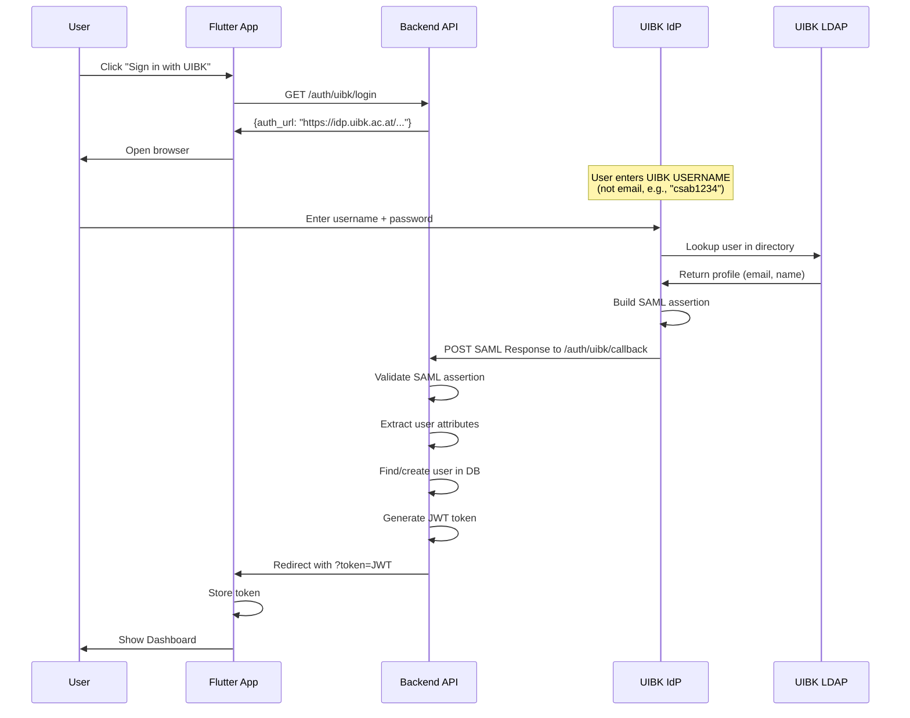

# UIBK Shibboleth SAML Authentication

This document explains how UIBK (University of Innsbruck) login works in the Twin2MultiCloud platform and how to configure it.

## Overview

UIBK uses **SAML 2.0** (Security Assertion Markup Language) for federated identity management via the **Shibboleth** Identity Provider (IdP). This allows university members to use their UIBK credentials to access external services.

### Key Concepts

- **SAML**: XML-based protocol for exchanging authentication data
- **Identity Provider (IdP)**: UIBK's server that authenticates users (`idp.uibk.ac.at`)
- **Service Provider (SP)**: Our application that trusts the IdP
- **eduID.at/ACOnet**: Austria's academic identity federation

## How UIBK Login Works



**Important**: The user logs in with their **UIBK username** (like "csab1234"), not their email. The email is automatically provided by the IdP from the university's LDAP directory.

## Configuration

### Environment Variables

```bash
# Enable UIBK SAML authentication
SAML_ENABLED=true

# Service Provider (your application)
SAML_SP_ENTITY_ID=https://twin2multicloud.uibk.ac.at
SAML_ACS_URL=https://api.twin2multicloud.uibk.ac.at/auth/uibk/callback
SAML_SP_CERT=<base64-encoded-certificate>
SAML_SP_KEY=<base64-encoded-private-key>

# Identity Provider (UIBK)
SAML_IDP_ENTITY_ID=https://idp.uibk.ac.at/idp/shibboleth
SAML_IDP_SSO_URL=https://idp.uibk.ac.at/idp/profile/SAML2/Redirect/SSO
SAML_IDP_CERT=<base64-encoded-idp-certificate>

# Frontend callback
FRONTEND_CALLBACK_URL=https://twin2multicloud.uibk.ac.at/auth/callback
```

### Local Development

For local development, use a mock SAML IdP:

```bash
# .env.local
SAML_ENABLED=true
SAML_SP_ENTITY_ID=http://localhost:5005
SAML_ACS_URL=http://localhost:5005/auth/uibk/callback
SAML_IDP_ENTITY_ID=http://localhost:8080/simplesaml/saml2/idp/metadata.php
SAML_IDP_SSO_URL=http://localhost:8080/simplesaml/saml2/idp/SSOService.php
FRONTEND_CALLBACK_URL=http://localhost:8080/auth/callback
```

You can run a mock IdP using SimpleSAMLphp in Docker:

```bash
docker run -d -p 8080:8080 kristophjunge/test-saml-idp
```

## ACOnet Registration Process

To connect to the real UIBK IdP, you must register as a Service Provider with ACOnet:

1. **Generate SP Certificate**:
   ```bash
   openssl req -new -x509 -days 365 -keyout sp-key.pem -out sp-cert.pem
   ```

2. **Download your SP Metadata**:
   ```
   GET /auth/uibk/metadata
   ```

3. **Sign ACOnet SP Agreement**:
   - Download from: https://www.aco.net/federation/
   - Requires authorized signature

4. **Submit to ACOnet**:
   - Email: federation@aco.net
   - Attach signed agreement + SP metadata

5. **Wait for Approval** (1-2 weeks)

## SAML Attributes

The UIBK IdP provides these attributes in the SAML assertion:

| Attribute | Description | Example |
|-----------|-------------|---------|
| `mail` | User's email | christoph.mueller@uibk.ac.at |
| `displayName` | Full name | Christoph Müller |
| `eduPersonPrincipalName` | Unique ID | csab1234@uibk.ac.at |

## Database Schema

The User model supports multiple authentication providers:

```python
class User(Base):
    id = Column(String, primary_key=True)
    email = Column(String, unique=True, nullable=False)
    name = Column(String, nullable=True)
    google_id = Column(String, unique=True, nullable=True)
    uibk_id = Column(String, unique=True, nullable=True)  # eduPersonPrincipalName
    auth_provider = Column(String, default="google")      # "google" | "uibk"
    last_login_at = Column(DateTime, nullable=True)
```

### Account Linking

If a user first logs in with Google, then later logs in with UIBK using the same email, the accounts are automatically linked. This is acceptable for a thesis demo with trusted university users.

## Troubleshooting

### Common SAML Errors

1. **"Invalid state"**: The RelayState parameter was lost. Check session storage.

2. **"SAML Error: Signature validation failed"**: The IdP certificate is incorrect. Re-download from IdP metadata.

3. **"Missing 'mail' attribute"**: The IdP is not releasing the email attribute. Check SP metadata attribute requirements.

4. **503 "UIBK login not available"**: 
   - `SAML_ENABLED` is false, or
   - `python3-saml` library is not installed

### Debug Mode

Enable debug logging in development:

```python
# config.py
DEBUG: bool = True  # Enables SAML debug output
```

## Extending to Other Universities

To add support for another eduGAIN university:

1. Get their IdP metadata URL
2. Add new config variables for their IdP
3. Create a new provider class or parameterize `UIBKSAMLProvider`
4. Register with ACOnet as supporting their IdP

## Files Reference

| File | Description |
|------|-------------|
| `src/auth/providers/saml.py` | SAML provider implementation |
| `src/api/routes/auth.py` | Authentication routes |
| `src/config.py` | SAML configuration settings |
| `src/models/user.py` | User model with multi-provider support |

## Security Considerations

1. **Certificate Security**: Store SP private key securely (environment variable, secret manager)
2. **HTTPS Required**: Production must use HTTPS for all callback URLs
3. **State Parameter**: Protects against CSRF attacks
4. **Account Linking**: Current implementation auto-links by email (acceptable for thesis)
